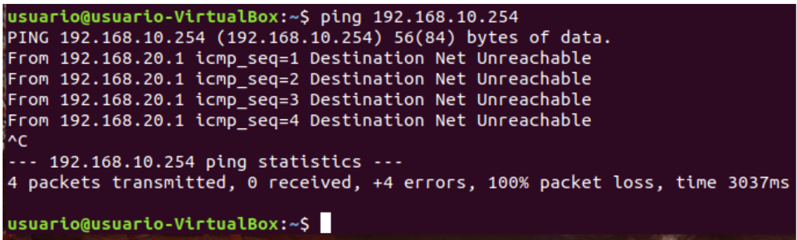

[Inicio](https://franciscocadena.github.io/PI-Mikrotik/)

# Comprobaciones

# Fase 1

## Comprobacion desde Cliente de Red

Para ello tan solo montamos un equipo en virtualbox, en este caso una ubuntu desktop, y lo fundamental es que en la parte de Red, esté en red interna y el nombre corresponda con la LAN a la cual hemos montado el servicio de dhcp. 

En la configuración de la red lo dejamos todo en automático, en la pestaña de _ipv4_

Y luego en la pestaña de _detalles_ podemos ver como la ip, el gateway y el dns corresponde a lo que nosotros definimos previamente en el servidor de DNS

Por último comprobamos que tiene ping desde la terminal y que puede navegar por internet.

## Comprobacion desde Cliente de Red por vlan

Ahora probamos a entrar en un cliente desde la vlan 10, para ello desde virtualbox tendremos nuestra ova de CHR con una interfaz interna llamada vlan 10 como se muestra a continuación.

Y un ubuntu desktop con un interfaz que pertenezca a esa misma red interna

Una vez dentro de nuestro SO de ubuntu vamo a la configuración de red para ver si nos ha dado nuestra ip por dhcp en la vlan 10

También podemos comprobar desde Mikrotik que ha dado ip a un equipo yendo a la pestaña de __Leases__ desde la ventana de Dhcp server, donde nos da información del equipo como la ip que se le a asignado, la MAC, nombre del host del equipo, el tiempo en el que expira la ip arrendada, etc.

Probamos a hacer ping desde la terminal.

Y a navegar a internet.

## Comprobaciones de reglas de firewall configuradas para la DMZ

#### Primero comenzaremos con el administrador de los servicios de la lan2 cuya ip es 192.168.20.2, el debe tener acceso a internet, poder hacer ping a la dmz, conectarse por ssh a la dmz, pero no debe tener acceso a la lan1.

Ping a uno de los servidores de la dmz

Conexión por ssh a uno de los servidores de la dmz

No conexión con un trabajador de la lan1

#### En cambio el otro administrador de la lan2 cuya ip es 192.168.20.3 y que se encarga de la red lan1 si tendrá conexión a esta y a internet pero no a la dmz ni tampoco por ssh.

IP del administrador de la lan2 que se encarga de mantener la lan1

Sin conexión a la dmz

Conexión a un trabajador de la red lan1

#### Pruebas con un servidor de la dmz cuya ip será 192.168.30.3, que deberá tener acceso a internet, conexión con el administrador de servidor de la lan2, y todo lo demás denegado.

Ping con el Administrador de la red lan2

No conexión con la red lan1

#### Ahora probaremos que la red lan1 no tendrá conexión con nadie excepto con el administrador de la lan2, la ip de uno de los trabajadores de la lan1 será 192.168.10.254.

Sin conexión a la dmz

Sin conexión al administrador de servidores de la lan2

Sin conexión a internet

Conexión con el administrador de la red lan2 que mantiene la lan1

#### Por último haremos la configuración de la última regla NAT que añadimos para hacer la comprobación de redirección de puertos, para ello podemos usar la máquina anfitriona en este caso una windows 10,  así que se realizará la prueba desde la powershell. 

IP configuradas del router mikrotik donde podemos observar la ip de la wan y de las diferentes LANES

Ip del equipo servidor de la dmz al cual vamos a entrar por ssh

Entrando por ssh al servidor de la dmz, usando la ip de la wan del router mikrotik

Comprobación de que estamos en el servidor de la dmz viendo su ip

Prueba con tracepath desde el servidor de la dmz estando por ssh desde el anfitrión

Prueba con traceroute desde el servidor de la dmz estando por ssh desde el anfitrión

## Comprobaciones de vpn por ipsec

Una de las comprobaciones que podemos hacer para ver si el túnel funciona es desde Winbox vamos al menú izquierdo, hacemos clic donde dice __Tools__ y luego a __Ping__.
En esta ventana debemos definir en la pestaña _General_  en el apartado de _Ping To_, la dirección a la cual queremos hacer ping, que en este caso será la interfaz del gateway de la red local del router con el que hemos establecido el túnel, luego vamos a la pestaña de _Advanced_ y en el apartado de _Src. Address_ escribimos la ip de la interfaz del router donde nos encontramos ahora mismo que da a la red lan de este.
Una vez configurada ambas ip, le daremos al botón de Start y en la pantalla de abajo deberá verse si hay respuesta.

La siguiente conexión será desde un cliente de una red a otro cliente de otra red lan diferente, en este caso la ip del cliente será 192.168.20.254 como se muestra en la siguiente imagen.

Y primero probaremos a hacer ping a la dirección 192.168.10.1 que corresponde a la interfaz de la lan del router que está al otro lado del túnel.

Y seguidamente haremos lo mismo pero con la ip de un cliente que pertenezca a la red lan que está al otro lado del túnel.

# Fase 2

## Comprobar Failover

Para realizar esta prueba entraremos por Winbox a uno de los router de la empresa, tendremos en pantalla, la terminal haciendo ping al 8.8.8.8 constantemente, la herramienta traceroute haciendo ping al 8.8.8.8 y la ventana de la lista de rutas.

A continuación desconectamos el ISP1 que es el que definimos como principal, y observaremos como se pierde la conexión, hasta que pasado un tiempo se conectará automáticamente al ISP2 volviendo a tener conexión, no solo será visible porque vuelva a hacer ping al 8.8.8.8 desde la terminal, sino porque se verá reflejado en la ventana de Router list, cambiando de color la ruta que antes estaba en azul a negra y también cambiará la sigla definiendo que estará activa.

Por último volvemos a activar el ISP1 que antes se apagó, en cuanto se inicie deberá volver a pasar el la Route List como el principal, y en la ventana de traceroute, donde se perdió toda la conexión deberá de activarse nuevamente.

## Comprobar VRRP

Para hacer la comprobación del vrrp , entraremos en un equipo cliente con SO Ubuntu desktop, comprobaremos su ip y gateway, para confirmar que está configurado según el Vrrp asociado al Router.

El siguiente paso será estar reproduciendo un video de youtube y estar haciendo ping al 8.8.8.8 continuamente desde el equipo cliente, también habrá  dos ventanas de Winbox donde veremos ambos router el maestro y el backup y dentro de cada una de estas ventanas veremos las ip e interfaces de ambos router, donde comprobaremos que el tráfico circula por el ether6-LAN del router maestro.

Seguidamente para no perder la conexión con Winbox del router maestro en vez de apagarlo desconectamos el interfaz ether6-LAN que es el que está conectado al equipo cliente.

Podemos comprobar como salta rápidamente el vrrp 1 del router backup, debido a que la respuesta es de unos 3 segundo, eso se puede confirmar viendo la ventana del equipo cliente que hace ping donde hay una parada de la secuencia del 41 al 45, apenas apreciable.
Acto seguido veremos como empieza a circular la conexión por el interfaz ether6-LAN del router backup.

Ahora volvemos a Conectar el cable ether6-LAN del router maestro.

Y en breves momento el vrrp 1 del backup vuelve a cambiar de negro a rojo, y la conexión vuelve a circular por el ether6-LAN del router maestro.

## Comprobar Ancho de Banda

Las pruebas se realizarán desde un Ubuntu desktop que se encuentre en la red LAN2, en la cual se mostrará en una imagen la ip del equipo que deberá corresponder con la de la red asignada, y el test de velocidad.

Seguidamente se realizará otro test de velocidad al mismo equipo con las reglas del ancho de banda ya definidas en el router y en donde deberá corresponder la ip del equipo a una de las reglas que se definen en el router.

Como se observa en las imágenes anteriores, al principio tenia 1Mb de subida y bajada, y después con la regla que se definió en el router tiene una subida de  0.3Mb y una bajada de  0.8Mb.

## Comprobar balanceo de carga por PCC

Para esta comprobación se a partido de una ubuntu desktop, perteneciente a la red dmz, en la imagen se muestra que la ip del equipo corresponde a dicha red, también se verá en la imagen que hay dos pestañas de internet donde se reproducen videos por youtube y desde Winbox estando conectado al router principal que le da red a la dmz, debe haber fluido de paquetes por ambas interfaces WAN.
Lo que no se puede apreciar es la suma relativa del balanceo de carga en la interfaz que da red a la dmz, esto es debido a 2 factores:
- Como se está usando una virtualización con la OVA de CHR, está restringe la conexión a 1Mb
- También como es una virtualización se requiere dos proveedores de internet dando acceso a internet, cuando en este ejemplo solo se cuenta con la red de casa.

# Fase 3

## Comprobar Port Knocking

Para realizar la comprobación del funcionamiento del port knocking primero mostraremos en una imagen las reglas creadas, para comprobar la cantidad de toques a realizar y por qué puertos debemos entrar. También se verán las interfaces e ip, en este caso nos conectaremos por la ip 192.168.0.23/24.

Luego estaremos en la pestaña de _address list_ estando conectado al router desde Winbox, he intentaremos por ssh y por winbox al router, dándonos error.  
 

En la siguiente imágenes veremos como vamos paso por paso conectándonos por ssh a los puertos definidos en las reglas, y la ip de nuestra máquina anfitriona irá apareciendo en la addresslist que corresponde a cada regla definida.

Primer toque, puerto 2000

Segundo toque, puerto 4000

Tercer toque, puerto 8000

Una vez que esté en la última address list podremos entrar por ssh sin tener que definir ningún puerto. 
También se puede ver el tiempo que estará la ip de nuestra máquina anfitriona en cada address list, cuando expire el tiempo de la última address list, la que da acceso seguro para entrar al router, nos echara del router, teniendo que repetir la secuencia.

Conexión por ssh sin necesidad del puerto porque ya está en la address list que tiene permiso de conexión.

Dentro de Mikrotik desde SSH, para confirmarlo se puede observar el nombre del router, las interfaces e ip tanto en el lado del winbox a la izquierda como en el lado de la conexión por ssh a la derecha de la imagen.

__Nota__ el cambio de color del powershell es debido a que una vez dentro de Mikrotik por ssh no se veía bien las letras, de hay que haya pasado a otro color.

## Comprobar el envío de correo por gmail

Para probar que funciona correctamente el envío de correo vamos a __Tools → Email__ y en la ventana que aparece le damos a _Send Email_, nos aparecerá una nueva ventana, rellenamos los campos en donde los primeros hacen referencia a nuestra cuenta con mikrotik, y luego definimos a qué correo se lo vamos a enviar y quien se lo envía, tal como se muestra en la siguiente imagen.

Después de darle a enviar revisamos nuestro correo para ver si nos ha llegado el mensaje y comprobar que funciona correctamente.

## Comprobar el envío de logs asignados

Como prueba para ver si funciona el aviso de errores y dhcp creadas en el router vamos a tener abierto los logs, las reglas creadas y vamos a desconectar uno de los interfaces wan que están como dhcp cliente.

Como vemos en el logs se a enviado un correo para notificarnos de un problema de dhcp.

Si ahora vamos a nuestro correo podemos ver como nos han llegado varios correos avisandonos de lo ocurrido en el router tanto con el servicio de dhcp como con la interfaz, dándonos diversos detalles cada correo.

## Comprobar la automatización de envios de Backups

Para probar de que tanto los script creados como las tareas programadas funcionan correctamente podemos modificar la hora de uno de los archivos para que correspondan con la hora que tenemos en ese momento.

O bien desde la ventana de los Script podemos seleccionar uno de ellos y luego darle al botón de __Run Script__.

El _Run Count_ corresponde a las veces que se a enviado por correo el script, o las veces que este se a ejecutado.
Hay que tener en cuenta que en el periodo de tiempo que definimos en las tareas es posible que de error o que no llegue algun correo si ambos _script_ deben ser enviados al mismo tiempo, por lo que recomiendo darle un margen entre un correo y otro.
 
A continuación comprobamos los correos que nos han llegado.

Y el archivo que nos ha llegado de este

## Comprobar funcionamiento de suricata

Vamos a probar el funcionamiento de suricata, para ello primero veremos los diferentes log de suricata y que nos aporta cada uno de ellos.
- __suricata.log:__ Recoge los eventos del mismo Suricata: inicializaciones, recargas, errores, etc.
- __stats.log:__ Recoge estadísticas regulares acerca del tráfico que se ha ido analizando hasta el momento.
- __fast.log:__ Recoge los eventos disparados por las reglas. Tiene como objetivo dar una impresión rápida y directa de los eventos.
- __eve.json:__ Recoge, igual que el anterior, los eventos disparados por las reglas, pero lo hace en formato JSON, lo que permite que posteriormente pueda ser interpretado de forma mucho más fácil por programas externos.

Bien una vez explicado un poco los diferentes archivos log, para hacer una pequeña prueba crearemos nuestra propia regla, para ello podemos hacerlo de varias formas la mas logica es crear un archivo de texto nuevo en la ruta por defecto que usa actualmente suricata la cual es _/var/lib/suricata/rules_, o también podemos crear un fichero de texto en la ruta /etc/suricata/rules la cual se crea automáticamente al instalar el _suricata-update_ el problema de esto es que deberemos especificar la ruta de este en el archivo de configuración de suricata en el apartado de __default-rule-path__, por ello es más recomendable crearlo en la ruta por defecto de _/var/lib/suricata/rules_.

Una vez creado el archivo de texto el cual podemos definir como _custom.rules_, dentro de este agregamos la siguiente línea __“alert icmp any any -> any any (msg: "ICMP detected"; sid: 1000001;)”__ salimos y guardamos, la regla anterior lo que hará será crear una alerta (visible en los logs) cada vez que detecte un paquete ICMP.

Una vez creada la alerta la definiremos en el archivo de configuración __suricata.yaml__, buscamos _rule-files_, y añadimos nuestra regla la cual definimos como _custom.rules_ debajo de _suricata.rules_.
Guardamos el archivo y reiniciamos suricata para que cargue las reglas nuevas.

Ahora arrancamos suricata con el siguiente comando
~~~
suricata -c /etc/suricata/suricata.yaml -i enp0s3
~~~

Con la opción _-c_ definimos la ruta del archivo de configuración, y con _-i_ definimos que corra en modo PCAP, con lo que le definimos el nombre de la interfaz que en caso es enp0s3

__Nota__. Es conveniente antes de ejecutar el comando anterior desactivar las funciones de descarga de paquetes en la interfaz de red en la que escucha Suricata con el siguiente comando.
~~~
ethtool -K enp0s3 gro off lro off
~~~

Si no tenemos la herramienta ethtool, la podemos instalar con.
~~~
sudo apt-get install ethtool
~~~

Si al ejecutar el comando nos aparece una línea comentando _Cannot change large-receive-offload_ significa que nuestra interfaz no es compatible con esta función y por tanto la  ignorara. 
Sin embargo, podemos verificar esto ejecutando el siguiente comando.
~~~
ethtool -k enp0s3 | grep large
~~~
El cual nos deberá responder con.
~~~
large-receive-offload: off [fixed]
~~~

Una vez realizado y confirmado lo anterior ejecutamos el comando
~~~
suricata -c /etc/suricata/suricata.yaml -i enp0s3
~~~

Y abrimos dos terminales nuevas, en una de ellas ejecutaremos el comando __tail -f /var/log/suricata/fast.log__ y en la otra terminal ejecutamos el comando __tail -f /var/log/suricata/eve.json__.

Teniendo todo listo abrimos una nueva terminal y hacemos ping al 8.8.8.8 por ejemplo o también podemos hacer ping desde un equipo diferente al equipo que tenga instalado suricata, si todo ha ido bien nos debería de saltar la información de los icmp capturados.

Ping al 8.8.8.8 desde la misma maquina.

Ping desde un windows 10 al equipo que tiene instalado suricata con ip 192.168.0.23.

## Comprobar funcionamiento de Suricata junto a Mikrotik

Para realizar la prueba partiremos del diagrama de la Fase 2 con los equipos Suricatas vinculados cada uno al router master y otro al router backup.

Una vez configurado Mikrotik, volvemos a nuestro Suricata, lo primero será crear una carpeta, por ejemplo dentro de la carpeta mikrotik creada donde nos descargamos la herramienta trafr, a la cual llamaremos _registros_.

Dentro de esta carpeta ejecutamos el siguiente comando estando como _root_ ya que las reglas de suricata están en un directorio donde solo tiene acceso el root.
__/usr/local/bin/trafr -s | suricata -c /etc/suricata/suricata.yaml -v -r /dev/stdin__
Con ello arrancamos la herramienta trafr que se encuentra actualmente en /usr/local/bin, y lo que recoge se lo envía a suricata el cual estará corriendo en modo pcap, enviando todo al directorio definido con la opción -r y procesandolos en orden.
El motivo de ejecutar el comando en la carpeta creada es porque al usar la opción -r en modo pcap (offline), suricata crea nuevos archivos .log en la ruta donde se ejecuta ese comando, por lo tanto en vez de visualizar los archivos de suricata que por defecto están en la ruta _/var/log/suricata_ visualizamos los nuevos creados.

Abrimos dos nuevas terminales, y nos dirigimos a la ruta _/mikrotik/registros_, para poder ver el tráfico que llega podemos usar 
~~~
tail -f fast.log
~~~
O si queremos más información podemos usar
~~~
tail -f eve.json | grep "ICMP detected"
~~~

Teniendo nuestro equipo Suricata preparado para escuchar los paquetes que le llegan encendemos desde GNS3 un equipo de cada red local que tenga acceso a internet, en este ejemplo se enciende el pc de la red _lan2 con ip 192.168.20.3_ y un equipo de la _dmz con ip 192.168.30.4_.

Comprobamos desde Suricata si recoje los icmp que se envían, usando la alerta __“alert icmp any any -> any any (msg: "ICMP detected"; sid: 1000001;)”__ y viéndolo desde el _fast.log y el eve.json_.

Primero realizamos los ping desde el equipo cuya ip es la _192.168.20.3_.
 
Hacemos ping al _1.1.1.1_.

 

Hacemos ping a la página de _www.marca.com_.

 

Hacemos ping al otro equipo encendido cuya ip es _192.168.30.4_.

 

Ahora pasamos ha hacer ping desde el otro equipo cuya ip es _192.168.30.4_.
Dejamos primero algo de separación en los dos archivos logs, para diferenciar las nuevas capturas de tráfico.
 
Hacemos ping a la página de _www.google.com_.

 

Hacemos ping al _9.9.9.9_

 

Hacemos ping al anterior equipo cuya ip es _192.168.20.3_.

## Comprobar funcionamiento de Layer 7

Para comprobar el funcionamiento de layer 7 se harán capturas de imágenes donde en el lado izquierdo tendremos el router con la pestaña de mangle el cual se podrá ver como aumenta el contador de paquetes en las 2 reglas mangles que se crearon para tal fin.
Y en el lado derecho se tendrá un equipo Ubuntu navegando por internet, en cual intentara entrar en la página youporn y facebook las cuales están bloqueadas y no tendrá acceso, pero si podrá entrar en otra que no esté definida en layer 7 como por ejemplo la página de marca.

Intentando entrar en youporn.

Intentando entrar en facebook, aumento de contadores de las reglas mangle, las cuales están subrayadas para diferenciarlas de las demás.

Intento de entrar en marca.

[Inicio](https://franciscocadena.github.io/PI-Mikrotik/)

