# En este apartado se explicara como configurar algunas herrameintas que aporten Alta Disponibilidad a nuestra Red.

Para ello nos guiaremos de la siguiente topografia.

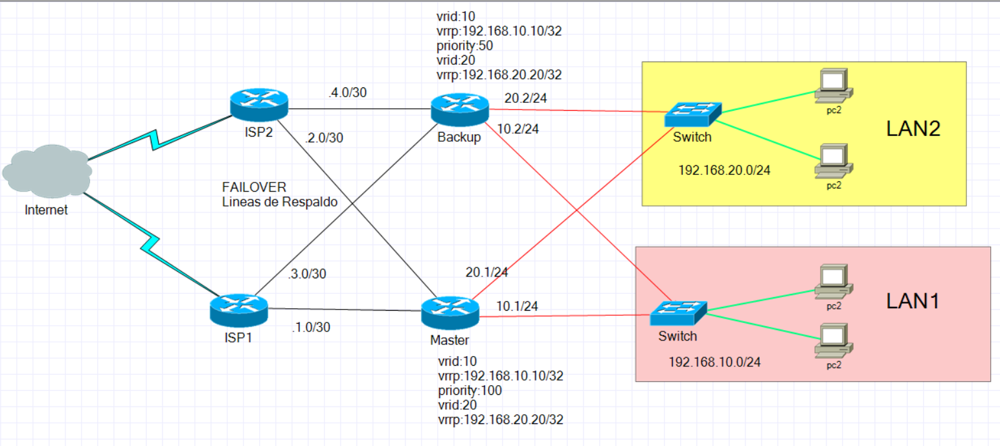

Los router __ISP__ no serían necesario tocarlos puesto que la ip nos la debería dar nuestro proveedor de internet, pero como esto es una virtualización explicaremos brevemente qué tipo de configuración básica le daremos.
 
Solo definiremos que tendrá tres interfaces uno que dé a internet, la cual tendrá ip dinámica y las otras dos interfaces corresponderá a los router de nuestra empresa donde le daremos un ip estática de __/30__.

Comencemos definiendo las interfaces del ISP, y a donde irá cada una.
 
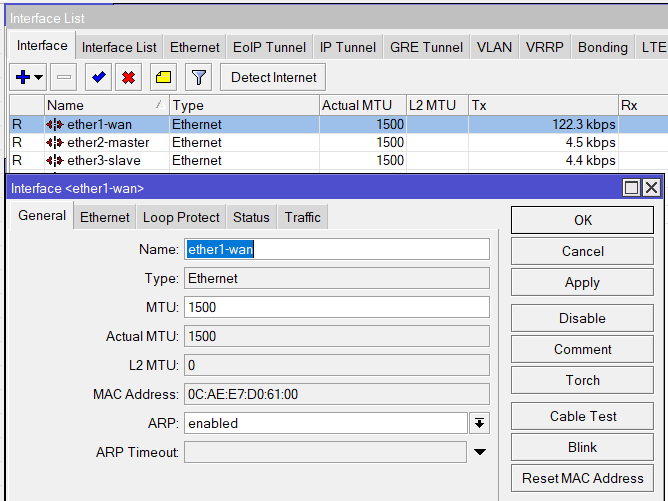
 
Seguiremos dándole ip dinámica a la interfaz WAN, para ello como siempre iremos a __ip →  dhcp__ cliente y definimos la regla para la WAN.

Ahora daremos direccionamiento a las otras dos interfaces que irán a los dos router que se encuentran en la empresa, estas ip serán estáticas con lo que no crearemos un servicio de dhcp, y seran /30.
 
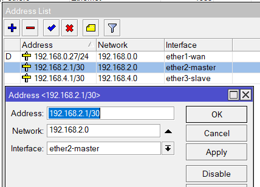

Definimos los servidores DNS y marcamos la casilla de __Allow Remote Request__.

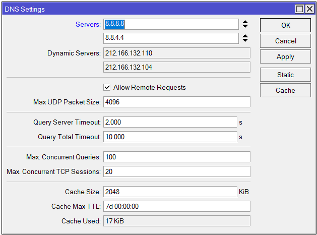

Por último creamos el enmascaramiento en NAT.

Todos estos pasos los realizaremos en ambos router ISP, teniendo precaución de no darle el mismo direccionamiento a las ip estáticas que van a los router de la empresa, por ejemplo.
- En el ISP1 se han configurado las siguientes ip:
  - 192.168.1.1/30 → Router Maestro
  - 192.168.3.1/.30 → Router Slave
- Y para el ISP2 se han configurado las siguiente ip:
  - 192.168.2.1/30 → Router Maestro
  - 192.168.4.1/30 → Router Slave

## Ahora pasaremos a los dos router que están en la empresa
 
Una buena práctica a la hora de trabajar con varios router y poder diferenciarlos es darles un nombre o identificador, para ello vamos al menú izquierdo donde dice __System → Identity__, en esta ventana podemos darle un nombre al router para poder definirlo.

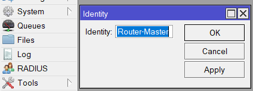

Como siempre lo primero que haremos sera la configuracion basica del router, definiendo las interfaces, el direccionamiento de cada interfaz, el dns, y el servicio dhcp, pero en este caso no será necesario.

Por ello solo dejaremos las imágenes de cómo quedaría la configuración de ambos router, haciendo el mismo procedimiento en el otro router, donde solo habrá que cambiar las ips de las interfaces. 

### Master

Interfaces

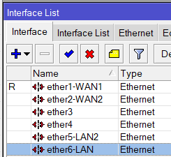

Ips

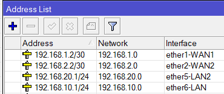

DNS

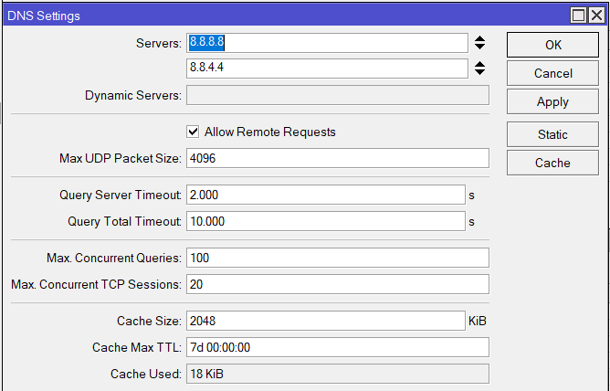

NAT, como tenemos dos WAN debermos crear dos reglas de NAT una por cada WAN

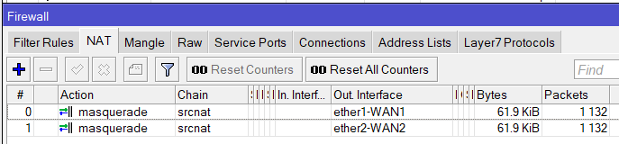

### Backup

Ips

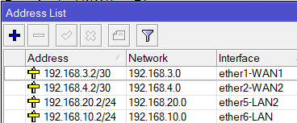

## Failover Rutas de Respaldo

Ahora pasaremos a configurar el Failover en ambos router de la empresa, la idea de esto es definir a los router que cuando se pierda la conexión con uno de los ISP tire por el otro definiendo cuál será el principal y cuál el secundario, por ello ambos router tendrán dos interfaces WAN uno por cada ISP.
Para ello tan solo debemos ir al menú izquierdo, darle a IP → Routes, añadimos una nueva ruta dándole al símbolo (+).
En esta ventana definimos:
- __Dst Address__ 0.0.0.0/0 (Toda IP)
- __Gateway__ 192.168.1.1
- __Check Gateway__ ping (con esto validará haciendo ping al gateway de que este funciona y hay conexión a el)
- __Distance__ 1 (con el 1 definimos que será la principal)

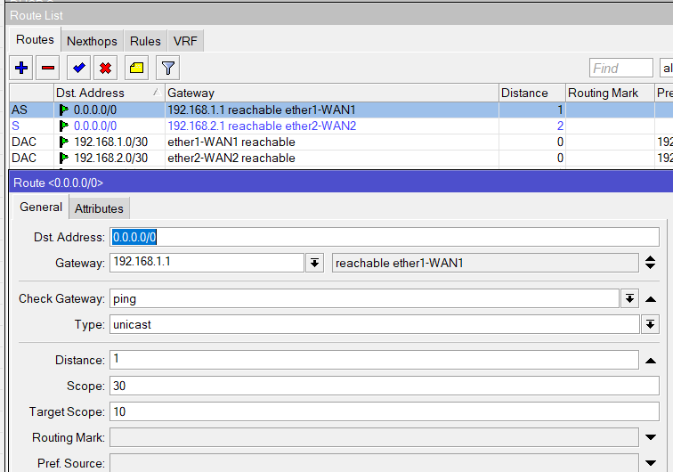

El resto podemos dejarlo por defecto.
 
Una vez creada esta regla, pasamos a crear la siguiente, con los siguientes parámetros:
- __Dst Address__ 0.0.0.0/0 (Toda IP)
- __Gateway__ 192.168.2.1
- __Check Gateway__ ping (con esto validará haciendo ping al gateway de que este funciona y hay conexión a el)
- __Distance__ 2 (con el 2 definimos que será la secundaria o backup)

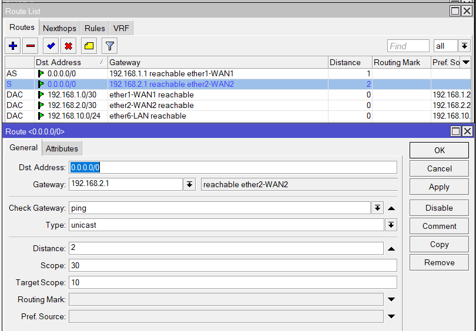
 
Como vemos la única diferencia con respecto a la anterior ha sido que hemos definido el otro gateway que corresponderá al otro ISP, será el secundario o ruta de respaldo, definido en Distance como 2.

Se puede observar en ambas imágenes, que la primera ruta que definimos con _Distance 1_ tiene un color negro y a la izquierda de la ventana tiene las siglas __AS__ correspondiendo la _A → active y la S → static_.
Mientas que la ruta que definimos con _Distance 2_ tiene un color azul y la sigla que aparece es solo __S → static__, eso nos indica que la ruta de color azul está a la espera y cuando se caiga la primera, se activará la segunda, eso se verá en el apartado de comprobaciones.  

Con esto conseguimos que cuando haya cualquier problema con el ISP1, nuestro router al hacer ping y comprobar que no hay respuesta pasará a hacer ping a la ruta de respaldo y si le responderá pasará a tirar el tráfico por este, con ello logramos no perder conexión a internet, solo una breve caída.

Este mismo proceso habrá que hacerlo en el otro router de la empresa, en donde solo habrá que cambiar las ip de los gateways en la creación de ambas rutas.

## VRRP

Este protocolo lo usaremos en aquellas LAN que no sean demasiado grandes y cuyas ip sean estáticas, esto es debido porque cuando una ip es dinámica y tiene 2 router dándole servicio de dhcp, en cuanto uno se caiga con volver a pedir ip por dhcp el mismo equipo cambiara la ip y el gateway, pero con  una ip estática no ocurre esto.

Por ello el protocolo vrrp lo que hace es crear un router virtual, y la ip que definimos en ese router virtual debe ser el mismo en ambos router, y será el gateway que usaremos en nuestros equipos que usen ip estática, de esta manera cuando haya cualquier problema con uno de los router el protocolo vrrp lo detectara y saltara al router de respaldo, consiguiendo así que el equipo cliente no se quede sin internet.

Lo primero que tendremos que hacer es ir a la pestaña de _VRRP_ dentro de la ventana de __interfaces list__, y darle al simbolo del (+) para crear uno.
En la ventana que nos aparece en la pestaña de _General_ tan solo definimos el nombre que deseamos que tenga nuestro vrrp, acto seguido vamos a la pestaña _VRRP_, y dentro de este configuraremos lo siguiente:
- __Interface__ ether6-LAN(donde definiremos en qué interfaz ira nuestro vrrp, en este caso será en LAN)
- __VRID__ 10 (este será el identificador de nuestro vrrp, es importante que este número coincida con el vrrp que crearemos en el router backup sino no funcionara el vrrp)
- Priority 100 (la prioridad define quien será el maestro y quien el backup, el que tenga un número mayor en este apartado será el master)

El resto de parámetros lo podemos dejar por defecto.

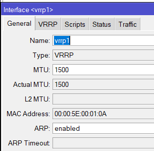

Como en este ejemplo de Red tenemos 2 redes estáticas, creamos otro vrrp, donde solo deberemos modificar el nombre, la interfaz que ahora será LAN2 y el VRID  a 20 por ejemplo, quedando como en la siguiente imagen.

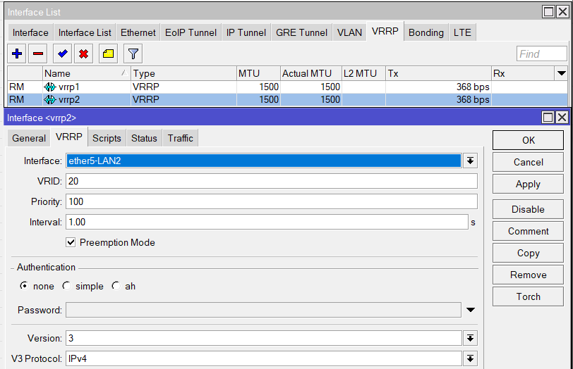

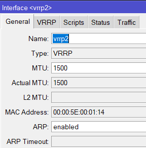

Una vez creadas ambas vrrp podemos ver como quedan en el apartado de interfaces.

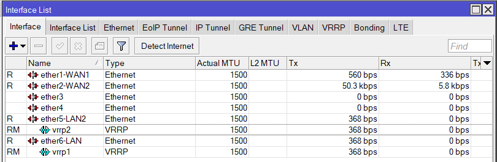

Las siglas de la izquierda de __RM__ hacen referencia a _R → running y M → master_.
Esto aparecerá una vez que esté ambos router configurados.

El siguiente paso será darle ip a ambos vrrp, como siempre para ello vamos al menú izquierdo IP → Address, símbolo del (+).
En la ventana seleccionamos uno de los vrrp creados y le damos una ip dentro del rango de la red, con la precaución de que debe terminar en /32.

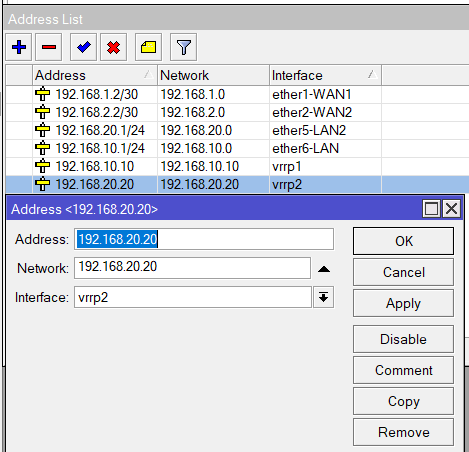

Hacemos el mismo procedimiento para el otro vrrp, definiendo una ip que corresponda a su red ya que cada vrrp que hemos creado es para una LAN diferente.

#### Ahora pasaremos a configurar los VRRP en el router que hara de Backup

Como hicimos con el router master, lo primero será crear los vrrp para cada LAN, donde lo único que cambiaremos será la interfaz y la prioridad, dejando el mismo VRID, quedando ambos router como se muestra en las siguientes imágenes.

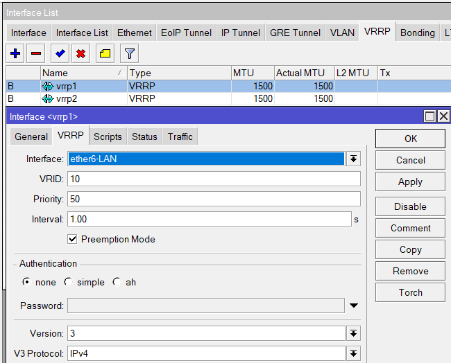

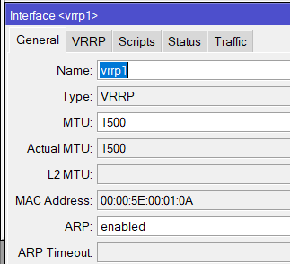

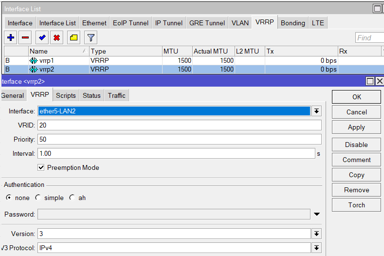

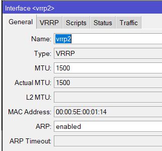

Una vez creado ambos vrrp, en la parte de interfaces podemos observar como ya están creadas y que aparece a la izquierda la sigla __B__ haciendo referencia  _B → backup_.

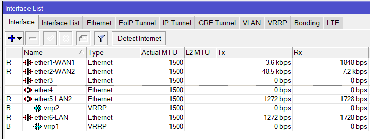

El siguiente paso será darle las ip a ambos vrrp. donde deberán coincidir las ip de esos con las que usamos en el router master, quedando de la siguiente manera.

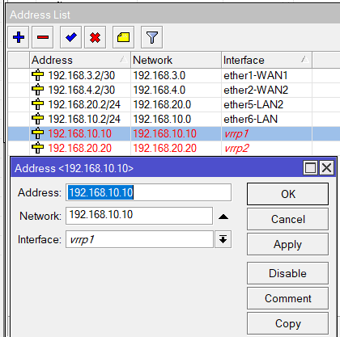

Una vez creada, aparecerán de color rojo eso es debido a que están en modo de espera, y cuando falle el maestro este saltara cambiando el color a negro debido a que se habrá activado.

Una vez configurado ambos Router con sus respectivos vrrp, solo queda poner la ip fija a nuestros equipos clientes con el correspondiente gateway a cada uno según a la LAN a la que pertenezcan. 
Con lo que a un equipo de la LAN le pondremos de gateway 192.168.10.10, y a los que pertenezcan a la LAN 2  le pondremos de gateway 192.168.20.20.

## Ancho de Banda

Realizaremos el ancho de banda en la LAN 2 por ejemplo, para ello desde Winbox nos dirigimos al menú izquierdo  y seleccionamos la opción de __Queues__, en la ventana que nos aparece marcamos la pestaña _Simple Queues_ y luego le damos al símbolo del (+).
En esta nueva ventana donde dice __Name__ tan solo escribimos un nombre a la regla para definirla.
En __Target__ definimos a quien se le asigna el ancho de banda pudiendo usar una _ip en concreto_, el _CIDR_ de la red o incluso el _interfaz_.
En __Target Upload__ vamos a _Max Limit_ y definimos la velocidad de subida.
En __Target Download__ vamos a _Max Limit_ y definimos la velocidad de bajada.
El resto lo podemos dejar por defecto, aplicamos y le damos a OK.

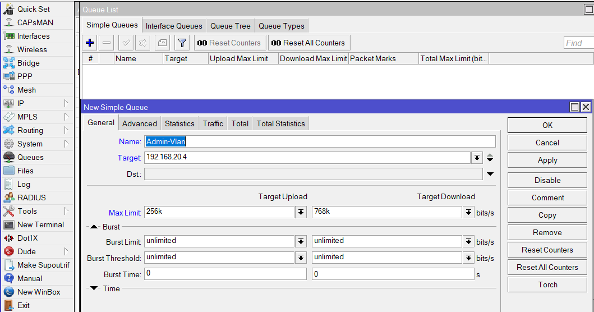

Para poder hacerlo más visual aplicaremos otra regla en la cual definiremos a toda la red LAN 2. Con ello lo que conseguiremos es definir el límite de velocidad de la LAN2 y al vez poder definir el límite de velocidad de cada equipo dentro de la red.

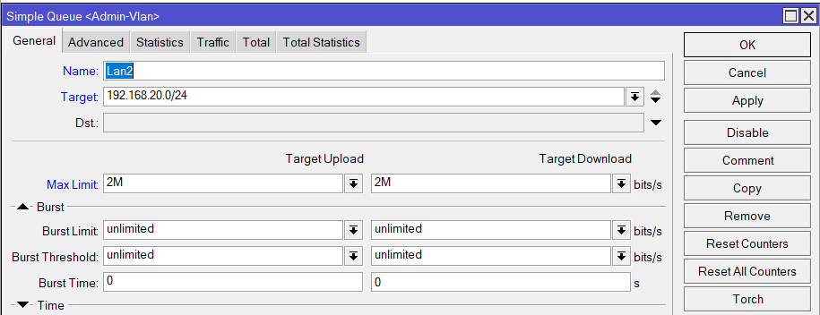

Hay que tener en cuenta de que estas reglas se aplican igual que las de firewall, es decir empieza a aplicarse las reglas desde la primera a la última por tanto la regla más genérica debe estar abajo que en este caso es la regla que hace referencia a la red LAN2,  y la regla más específica debe estar más arriba que en este caso corresponde a la ip 192.168.20.4, quedando como se muestra en la imagen.

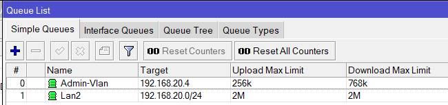

Si no seguimos este orden y dejamos la regla más general primero toda la red LAN2 tendrá el límite de velocidad indicado, sin aplicarse las otras reglas que definen la ip de cada equipo.
 
__Nota:__ Los colores del icono cambian dependiendo del uso que le dé al ancho de banda asignado; entonces, si se usa de un 0% a 50% del ancho de banda, la regla estará de color verde, si se usa del 50% a 70%, se volverá de color amarillo, y si sobrepasa el 70% se volverá de color rojo.

## Balanceo de carga con PCC

Para realizar el balanceo de carga seguiremos el diagrama de red del principio con la diferencia de que añadiremos una nueva red con la siguiente red 192.168.30.0/24, a la cual la llamaremos DMZ. El resto será igual.
Comenzamos yendo a __IP → FIREWALL__ y luego a la pestaña de _Mangle_ seguidamente añadimos una nueva regla dandole al simbolo del (+), en la nueva ventana que nos aparece estando en la pestaña de _General_ tan solo definimos en el apartado de __Chain__  con _prerouting_ y en el apartado __Dst.Address__ añadimos la red de una de las WAN que tenemos. Si tenemos varias redes LAN podemos definirla en __In. Interface__, si solo tenemos una o queremos que se aplique a todas no es necesario definirla.

Luego vamos a la Pestaña de _Action_ y en el apartado de __Action__ seleccionamos _Accept_, aplicamos y ok.

Esta regla la deberemos de repetir por cada interfaz que de acceso a internet, es decir si por ejemplo tenemos cuatro proveedores de internet habrá que crear cuatro reglas como estas en donde solo habrá que cambiar el apartado de __Dst.Address__ por el CIDR correspondiente a cada ISP. En nuestro caso serán solo dos reglas, puesto que tenemos dos interfaces Wan.

Nuestro siguiente paso será crear reglas para marcar todas las peticiones de las conexiones que vengan desde internet.
Para ello creamos una nueva regla, en la pestaña _General_ definimos en __Chain__ como _prerouting_, en __In Interface__ seleccionamos una de las interfaces que den acceso a Internet, y en el apatado de __Connection Mark__ lo dejamos en _no mark_.

Ahora pasamos a la pestaña de _Action_, aquí en el apartado de __Action__ seleccionamos _mark connection_, en el apartado de __New Connection Mark__ damos un nombre que queramos, que nos sirva para  definirlo, y dejamos marcada la casilla de __Passthrough__, esto nos permite que si no se cumple esta regla pase a la siguiente que tengamos creada.

Las siguientes  reglas corresponden a cada proveedor de internet y a una interfaz que vaya a una red local que nosotros definimos.
Como siempre empezamos dandole al símbolo del (+) para crear una nueva regla, en la pestaña _General_ seleccionamos _prerouting_ en el apartado de __Chain__, en el apartado de __In Interface__ seleccionamos la red Lan que deseamos, en este caso será la interfaz que va a la DMZ.

Luego pasamos a la pestaña de _Advanced_ y en el apartado de __Per Connection Classifer__ seleccionamos _both addresses_ y nos saldrá a la derecha dos apartados para insertar números.
 El primer número corresponde con la cantidad total de ISP que tengamos conectados a nuestro router, y el siguiente número corresponde al ISP para el que estamos creando la regla empezando siempre desde cero.
Por ejemplo si tenemos cuatro ISP conectados al router habrá que crear cuatro reglas, una por cada ISP conectado a nuestro router y el orden numérico para cada regla sería el siguiente:
- 4/0
- 4/1
- 4/2
- 4/3
Como se observa el primer número no cambia porque hace referencia al total, el que cambia es el segundo para saber a quien se le está aplicando la regla, como se empieza a contar desde el 0, si tenemos 4 ISP la cuenta será desde el 0 hasta el 3.

Ahora pasamos a la pestaña _Extra_ aquí buscamos la opción de __Dst.Address Type__, y en _Addres Type__ seleccionamos _local_,  y marcamos la casilla de _Invert_.

Por último vamos a la pestaña de _Action_, en esta seleccionamos _mark connection_ en el apartado de __Action__, en el apartado de __New Connection Mark__ seleccionamos uno de los nombres que definimos en las reglas anteriores para cada ISP, y dejamos marcada la opción de __Passtrough__. 

Como siempre se crearán tantas reglas como wan tengamos, como en este caso tenemos dos, habrá que crear otra regla idéntica a la anterior cambiando solamente en la pestaña _Action_ en el apartado _New connection Mark_ al nombre que le hayamos dado para la regla del otro ISP que tenemos conectado, y en la pestaña de _Advanced_ en el apartado de __Per Connection Classifier__ al seleccionar  _both addresses_ debemos cambiar el segundo número por el que corresponda que en este caso será 1, haciendo referencia al segundo ISP.

Las siguientes reglas serán para marcar la ruta de todos los paquetes que pasan por las conexiones.
En la pestaña _General_ seleccionamos el interfaz que va a nuestra red local en el apartado de __In Interface__, y en el apartado de __Connection Mark__ seleccionamos uno de los nombres que creamos al definir la regla de marcado de peticiones de conexión para cada ISP.

Luego pasamos a la pestaña de _Action_ en donde seleccionamos _mark routing_ en el apartado de __Action__, dejamos marcado la opción del __Passthrough__ y en el apartado de __New Routing Mark__ damos un nombre que haga referencia a uno de los ISP. 
Aplicamos y ok.

Creamos otra regla idéntica a la anterior para el otro ISP cambiando solo el apartado de __Connection Mark__ dentro de la pestaña _General_ por el nombre de la regla que hace referencia al otro ISP, y en la pestaña de _Action_ daremos otro nombre para identificar al otro ISP en el apartado de __New Routing Mark__

Ahora crearemos otras reglas como siempre una para cada ISP que tengamos conectado al router, para el _chain outpust_.
Por lo tanto en la nueva regla, en la pestaña _General_ seleccionamos _output_ en el apartado de __Chain__, y en el apartado de __Connection Mark__ seleccionamos uno de los nombres que definimos en las reglas para marcado de peticiones por conexiones para el ISP, en la siguiente regla que creemos se deberá cambiar solo este apartado seleccionando el nombre de la otra regla del otro ISP.

Pasamos a la pestaña de _Action_, en donde seleccionamos _mark routing_ en el apartado de __Action__, dejamos marcado __Passthroug__ y en el apartado de __New Routing Mark__ seleccionamos uno de los nombres que creamos cuando definimos las reglas de rutas de los paquetes. Cuando creemos las otras reglas este apartado será otro de los que cambie definiendo los otros nombres que definimos al crear las reglas de marcado de paquetes. 

Una vez creada todas las reglas para los dos ISP que tenemos en este ejemplo debería quedar como en la siguiente imagen.

El siguiente paso será agregar las rutas a la tabla de ruteo, para ello vamos a IP → Routes, y le damos al (+). Crearemos una ruta por cada ISP que tengamos conectado al router.
En esta ventana definimos como direcciones de destino todas, así que en el apartado de __Dst. Address__ escribimos 0.0.0.0/0.
En __Gateway__ escribimos la ip de nuestro ISP, en __Check Gateway__ lo dejamos en ping, dejamos todo lo demas por defecto y lo que debemos modificar es el apartado de __Routing Mark__ donde seleccionaremos uno de los nombre que definimos en las reglas que creamos para el marcado de ruta de los paquetes, lo interesante será que el nombre corresponda con la ip del ISP que estamos definiendo en la ruta.

Con esto conseguimos que todo el tráfico marcado para isp1 salga por el gateway que hemos definido.
La siguiente ruta que creemos para el otro ISP será idéntica a la anterior cambiando solo la ip del __Gateway__ por el otro ISP  y el apartado de __Routing Mark__ donde seleccionaremos el otro nombre de la otra regla creada de marcado de rutas.

Quedando las rutas como se muestra en la imagen.

