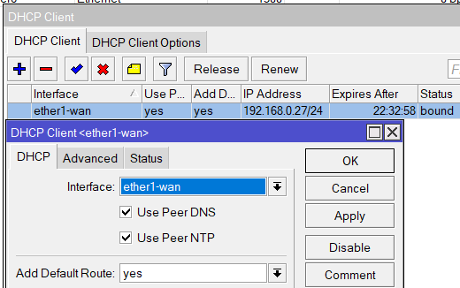

# En este apartado se explicara como configurar algunas herrameintas que aporten Alta Disponibilidad a nuestra Red.

Para ello nos guiaremos de la siguiente topografia.

Los router __ISP__ no serían necesario tocarlos puesto que la ip nos la debería dar nuestro proveedor de internet, pero como esto es una virtualización explicaremos brevemente qué tipo de configuración básica le daremos.
 
Solo definiremos que tendrá tres interfaces uno que dé a internet, la cual tendrá ip dinámica y las otras dos interfaces corresponderá a los router de nuestra empresa donde le daremos un ip estática de __/30__.

Comencemos definiendo las interfaces del ISP, y a donde irá cada una.
 

 
Seguiremos dándole ip dinámica a la interfaz WAN, para ello como siempre iremos a __ip →  dhcp__ cliente y definimos la regla para la WAN.

Ahora daremos direccionamiento a las otras dos interfaces que irán a los dos router que se encuentran en la empresa, estas ip serán estáticas con lo que no crearemos un servicio de dhcp, y seran /30.
 

Definimos los servidores DNS y marcamos la casilla de __Allow Remote Request__.

Por último creamos el enmascaramiento en NAT.

Todos estos pasos los realizaremos en ambos router ISP, teniendo precaución de no darle el mismo direccionamiento a las ip estáticas que van a los router de la empresa, por ejemplo.
- En el ISP1 se han configurado las siguientes ip:
  - 192.168.1.1/30 → Router Maestro
  - 192.168.3.1/.30 → Router Slave
- Y para el ISP2 se han configurado las siguiente ip:
  - 192.168.2.1/30 → Router Maestro
  - 192.168.4.1/30 → Router Slave

## Ahora pasaremos a los dos router que están en la empresa
 
Una buena práctica a la hora de trabajar con varios router y poder diferenciarlos es darles un nombre o identificador, para ello vamos al menú izquierdo donde dice __System → Identity__, en esta ventana podemos darle un nombre al router para poder definirlo.

Como siempre lo primero que haremos sera la configuracion basica del router, definiendo las interfaces, el direccionamiento de cada interfaz, el dns, y el servicio dhcp, pero en este caso no será necesario.

Por ello solo dejaremos las imágenes de cómo quedaría la configuración de ambos router, haciendo el mismo procedimiento en el otro router, donde solo habrá que cambiar las ips de las interfaces. 

### Master

Interfaces

Ips

DNS

NAT, como tenemos dos WAN debermos crear dos reglas de NAT una por cada WAN

### Backup

Ips

### Failover Rutas de Respaldo

Ahora pasaremos a configurar el Failover en ambos router de la empresa, la idea de esto es definir a los router que cuando se pierda la conexión con uno de los ISP tire por el otro definiendo cuál será el principal y cuál el secundario, por ello ambos router tendrán dos interfaces WAN uno por cada ISP.
Para ello tan solo debemos ir al menú izquierdo, darle a IP → Routes, añadimos una nueva ruta dándole al símbolo (+).
En esta ventana definimos:
- __Dst Address__ 0.0.0.0/0 (Toda IP)
- __Gateway__ 192.168.1.1
- __Check Gateway__ ping (con esto validará haciendo ping al gateway de que este funciona y hay conexión a el)
- __Distance__ 1 (con el 1 definimos que será la principal)

El resto podemos dejarlo por defecto.
 
Una vez creada esta regla, pasamos a crear la siguiente, con los siguientes parámetros:
- __Dst Address__ 0.0.0.0/0 (Toda IP)
- __Gateway__ 192.168.2.1
- __Check Gateway__ ping (con esto validará haciendo ping al gateway de que este funciona y hay conexión a el)
- __Distance__ 2 (con el 2 definimos que será la secundaria o backup)

 
Como vemos la única diferencia con respecto a la anterior ha sido que hemos definido el otro gateway que corresponderá al otro ISP, será el secundario o ruta de respaldo, definido en Distance como 2.

Se puede observar en ambas imágenes, que la primera ruta que definimos con _Distance 1_ tiene un color negro y a la izquierda de la ventana tiene las siglas __AS__ correspondiendo la _A → active y la S → static_.
Mientas que la ruta que definimos con _Distance 2_ tiene un color azul y la sigla que aparece es solo __S → static__, eso nos indica que la ruta de color azul está a la espera y cuando se caiga la primera, se activará la segunda, eso se verá en el apartado de comprobaciones.  

Con esto conseguimos que cuando haya cualquier problema con el ISP1, nuestro router al hacer ping y comprobar que no hay respuesta pasará a hacer ping a la ruta de respaldo y si le responderá pasará a tirar el tráfico por este, con ello logramos no perder conexión a internet, solo una breve caída.

Este mismo proceso habrá que hacerlo en el otro router de la empresa, en donde solo habrá que cambiar las ip de los gateways en la creación de ambas rutas.

### VRRP

Este protocolo lo usaremos en aquellas LAN que no sean demasiado grandes y cuyas ip sean estáticas, esto es debido porque cuando una ip es dinámica y tiene 2 router dándole servicio de dhcp, en cuanto uno se caiga con volver a pedir ip por dhcp el mismo equipo cambiara la ip y el gateway, pero con  una ip estática no ocurre esto.

Por ello el protocolo vrrp lo que hace es crear un router virtual, y la ip que definimos en ese router virtual debe ser el mismo en ambos router, y será el gateway que usaremos en nuestros equipos que usen ip estática, de esta manera cuando haya cualquier problema con uno de los router el protocolo vrrp lo detectara y saltara al router de respaldo, consiguiendo así que el equipo cliente no se quede sin internet.

Lo primero que tendremos que hacer es ir a la pestaña de _VRRP_ dentro de la ventana de __interfaces list__, y darle al simbolo del (+) para crear uno.
En la ventana que nos aparece en la pestaña de _General_ tan solo definimos el nombre que deseamos que tenga nuestro vrrp, acto seguido vamos a la pestaña _VRRP_, y dentro de este configuraremos lo siguiente:
- __Interface__ ether6-LAN(donde definiremos en qué interfaz ira nuestro vrrp, en este caso será en LAN)
- __VRID__ 10 (este será el identificador de nuestro vrrp, es importante que este número coincida con el vrrp que crearemos en el router backup sino no funcionara el vrrp)
- Priority 100 (la prioridad define quien será el maestro y quien el backup, el que tenga un número mayor en este apartado será el master)

El resto de parámetros lo podemos dejar por defecto.

Como en este ejemplo de Red tenemos 2 redes estáticas, creamos otro vrrp, donde solo deberemos modificar el nombre, la interfaz que ahora será LAN2 y el VRID  a 20 por ejemplo, quedando como en la siguiente imagen.

Una vez creadas ambas vrrp podemos ver como quedan en el apartado de interfaces.

Las siglas de la izquierda de __RM__ hacen referencia a _R → running y M → master_.
Esto aparecerá una vez que esté ambos router configurados.

El siguiente paso será darle ip a ambos vrrp, como siempre para ello vamos al menú izquierdo IP → Address, símbolo del (+).
En la ventana seleccionamos uno de los vrrp creados y le damos una ip dentro del rango de la red, con la precaución de que debe terminar en /32.

Hacemos el mismo procedimiento para el otro vrrp, definiendo una ip que corresponda a su red ya que cada vrrp que hemos creado es para una LAN diferente.

#### Ahora pasaremos a configurar los VRRP en el router que hara de Backup

Como hicimos con el router master, lo primero será crear los vrrp para cada LAN, donde lo único que cambiaremos será la interfaz y la prioridad, dejando el mismo VRID, quedando ambos router como se muestra en las siguientes imágenes.

Una vez creado ambos vrrp, en la parte de interfaces podemos observar como ya están creadas y que aparece a la izquierda la sigla __B__ haciendo referencia  _B → backup_.

El siguiente paso será darle las ip a ambos vrrp. donde deberán coincidir las ip de esos con las que usamos en el router master, quedando de la siguiente manera.

Una vez creada, aparecerán de color rojo eso es debido a que están en modo de espera, y cuando falle el maestro este saltara cambiando el color a negro debido a que se habrá activado.

Una vez configurado ambos Router con sus respectivos vrrp, solo queda poner la ip fija a nuestros equipos clientes con el correspondiente gateway a cada uno según a la LAN a la que pertenezcan. 
Con lo que a un equipo de la LAN le pondremos de gateway 192.168.10.10, y a los que pertenezcan a la LAN 2  le pondremos de gateway 192.168.20.20.

