# Seguridad

Según el diagrama siguiente vamos a explicar como configurar el __Port Knocking__.

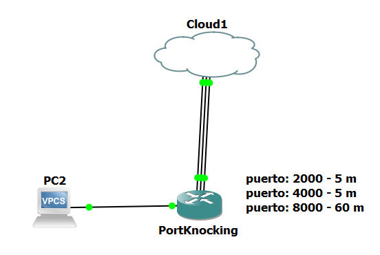

Partiremos de un router multiwan cuyas ip sean estáticas, y una red lan con servicio dhcp.

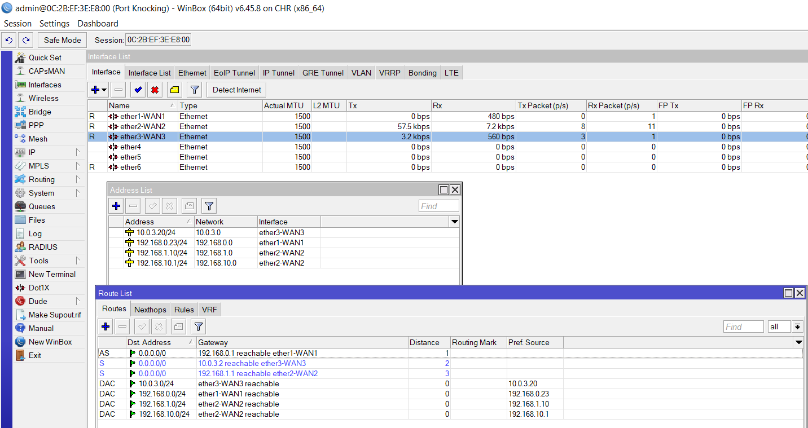

## Crear Lista de Interfaces

Lo primero que podemos hacer para facilitar el trabajo a la hora de crear las reglas de firewall es definir todas las redes WAN en una lista.
Para ello estando en la ventana de Interfaces vamos a la pestaña de _Interface List_.
Le damos al botón que dice __List__ y en la nueva ventana de _Interface Lists_ le damos al símbolo del (+), en la nueva ventana llamada _New Interface List_ vamos al aparatado de __Name__ donde definiremos el nombre que queramos en este caso _WAN_, aplicamos y ok. Con esto ya nos aparecerá el nombre definido en la lista de interfaces.

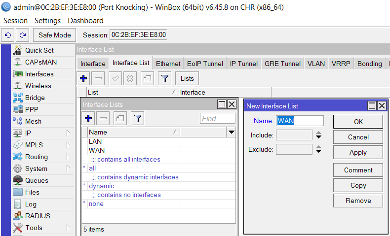

Ahora regresaremos a la ventana principal de _Interface List_ y le damos al (+), en esta nueva ventana lo que haremos será en el apartado _List_ elegir __WAN__ que fue el nombre que definimos antes, y en el apartado interface seleccionamos una de las diferentes interfaces wan que tengamos, en este caso como tengo tres debo agregar las tres interfaces a la lista wan.

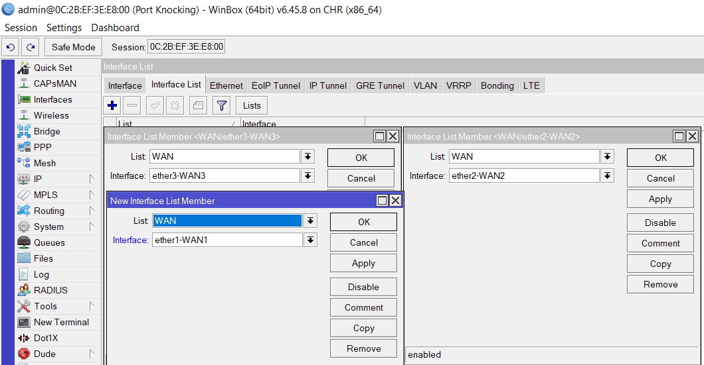

Al final nos debe quedar la lista como en la imagen siguiente.

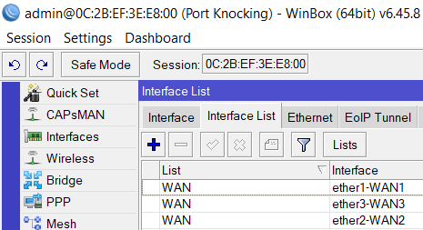

## Port Knocking

Ahora pasamos a crear las reglas del port knocking, para ello vamos a __IP → Firewall__ y luego agregamos una regla dándole al (+).
En este ejemplo haremos que los golpes de puertos necesarios para poder entrar al router ya sea por (WinBox, SSH, Telenet, etc.) sean tres, tal y como se ve en la primera imagen de la topografía de red.
Lo primero en la pestaña _General_ vamos al apartado _Chain_ y le asignamos __Input__, luego vamos al apartado _Protocol_  y seleccionamos __6(tcp)__.
Al asignar un protocolo podremos definir los puertos de _Source y Destiny_ en este caso iremos al _Ds. Ports_ y escribimos 2000.
Lo siguiente será definir el interfaz wan de entrada en el apartado _In Interface_, el problema es que como en este ejemplo tenemos tres interfaces wan, se deberia crear tres reglas iguales para cada interfaz, por ello para simplificarlo y no crear tantas reglas, definimos con anterioridad una lista wan para todas las interfaces que van por wan.
Con lo cual nosotros vamos al apartado de _In Interface List_ y seleccionamos nuestra lista __WAN__ anteriormente creada, con esto tan solo hemos creado una regla definiendo a la entrada de todas las interfaces wan que tengamos asignada a esa lista, en vez de tener que crear una regla para cada interfaz de entrada por wan.

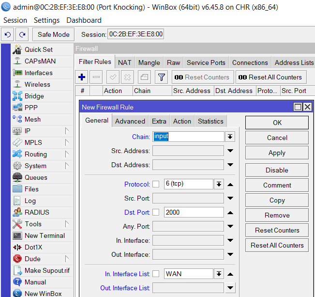

Ahora pasamos a la pestaña de _Action_, y seleccionamos la opción de __add src to address list__  en el apartado de _Action_.
Luego en _Address List_ definimos el nombre que nosotros queramos, en este ejemplo se ha usado __temporal__.
Y en el apartado de _Timeout_ definimos el tiempo que la ip va a estar en esta lista, en este ejemplo se a usado una duración de 5 minutos (00:05:00).
Aplicamos y OK.

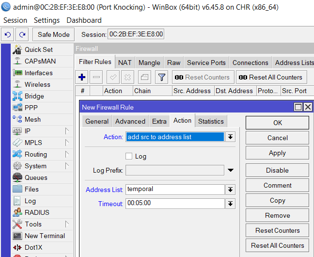

Vamos a explicar que hace esta regla que acabamos de definir.
Lo que hemos hecho es definir que todo lo que entre al router por cualquier interfaz wan que se encuentre en la lista definida, y use el protocolo tcp y el puerto de destino 2000, lo agregue a una lista de direcciones que hemos llamado temporal, con una duración de 5 minutos, pasado ese tiempo se eliminará de la lista.
 
Ahora crearemos la siguiente regla que corresponderá con el segundo toque o golpeo de puerto.

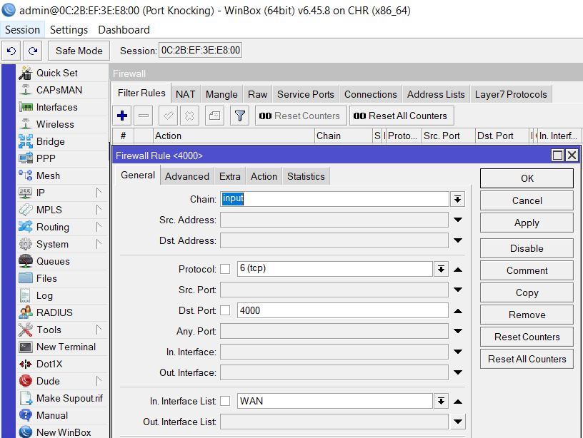

Como se ve en la imagen anterior de momento lo único que se ha cambiado en la pestaña _General_ a sido el __puerto de Destino__ que ahora es _4000_.
Ahora pasamos a la pestaña _Advanced_, una vez aquí vamos al apartado de _Src. Address List_ y seleccionamos __temporal__.

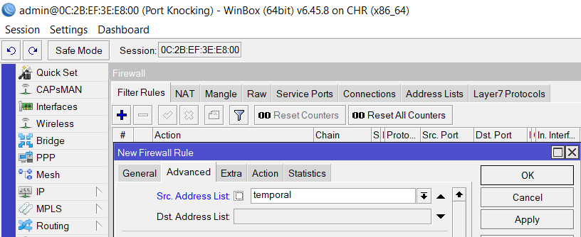

Ahora pasamos a la pestaña _Action_ y definimos en el apartado de _Action_ __add src to address list__ en _Timeout_ podemos dejarlo de nuevo en 5 minutos eso es al gusto de cada uno, y en _Address List_ definimos un nuevo nombre, en este caso se a usado __permitido__.
Aplicamos y ok.

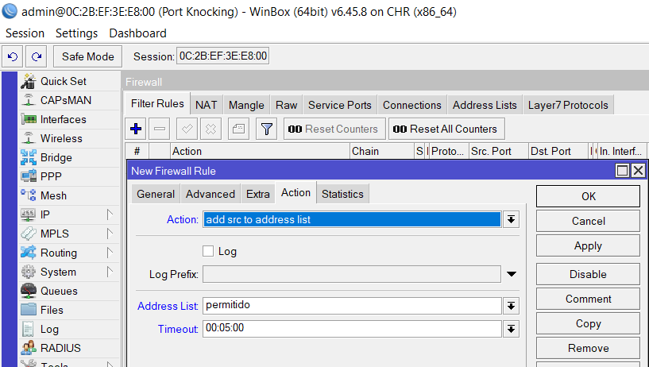

Con esta segunda regla lo que hemos definido es que todas las ip que se encuentren en la lista de temporal tendrán que hacer una conexión al puerto 4000, y pasarán a estar por 5 minutos en otra lista de ip a la que hemos denominado permitido.
 
Ahora pasamos a definir el tercer toque o golpeo de puerto tal y como venía en el diagrama de red.
Los pasos serán muy parecidos a los aplicados a la segunda regla, con lo que en la pestaña general solo cambiamos el _Dst. Port_ por 8000.

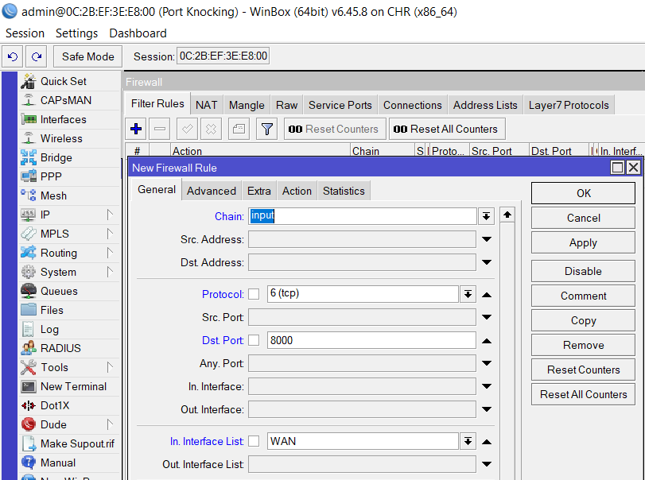

Seguidamente vamos a la pestaña de _Advanced_ y en el apartado de _Src. Address List_ definimos a la lista de ip que se encuentran en __permitido__ que son los que han realizado satisfactoriamente el primer y el segundo toque o golpeo de puerto.

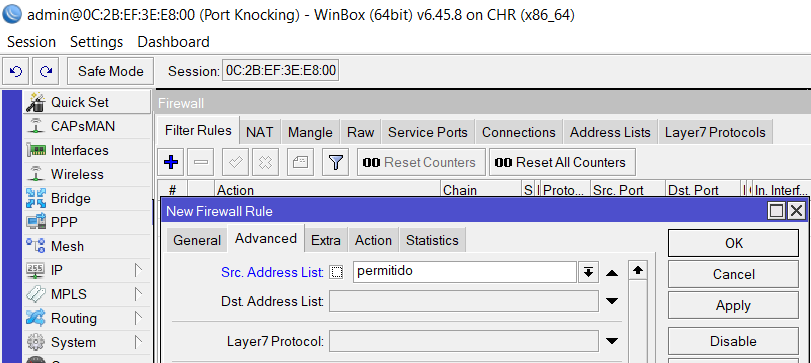

Luego vamos a la pestaña de _Action_ donde volvemos a seleccionar __add src to address list__ en el apartado de _Action_, en _Address List__ nombramos a la nueva lista como seguro, y en _Timeout_ esta vez le daremos bastante más tiempo que lo usados anteriormente en este caso 1 hora (01:00:00) o 60 minutos (00:60:00) ambas valen. 

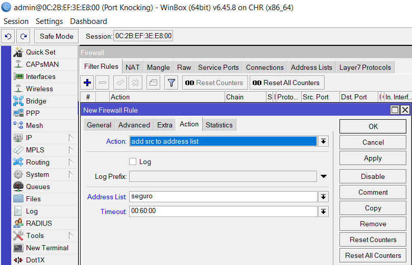

El motivo de añadir más tiempo a esta lista de ips es debido a que este será el último golpeo de puerto para poder acceder al router y por tanto esta ip tendrá acceso al router mientras se encuentre en esta lista, pasado ese tiempo será borrado y se le denegara el acceso al router, esto quiere decir que pasado 1 hora, la ip que haya podido acceder al router será eliminada de la lista y por tanto se le echara del router, debiendo conectarse nuevamente llamando a los tres toques o golpes de puerto que hemos definido.
Lo dos toques anteriores tenían un tiempo menor porque es el tiempo que le definimos para que llame al siguiente puerto, esto ayuda a que un cracker tenga poco tiempo para poder averiguar cual es el siguiente protocolo y puerto que debe usar para poder pasar la siguiente barrera de protección, puesto que pasado ese tiempo deberá empezara de nuevo llamando al primer puerto que se definió en la primera regla.
 
Ahora pasamos a definir la regla de aceptación.
En la pestaña _General_ tan solo definimos en _Chain_ el modo __Input_ y en _In. Interface List_ __WAN__.

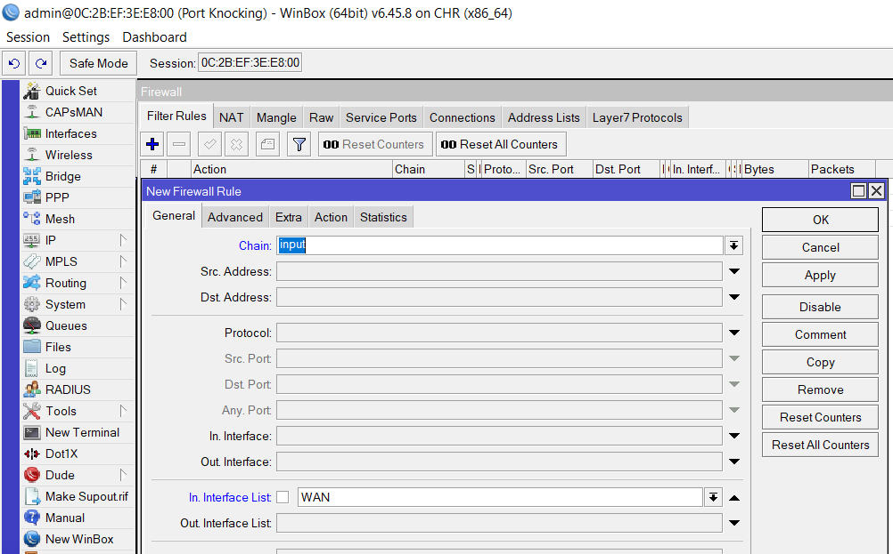

Luego pasamos a la pestaña de _Advanced_ donde en _Src. address List_ definimos a las ip que se encuentren en la lista de __seguro__ ya que estas ip previamente han tenido que pasar las dos reglas anteriores que definimos.

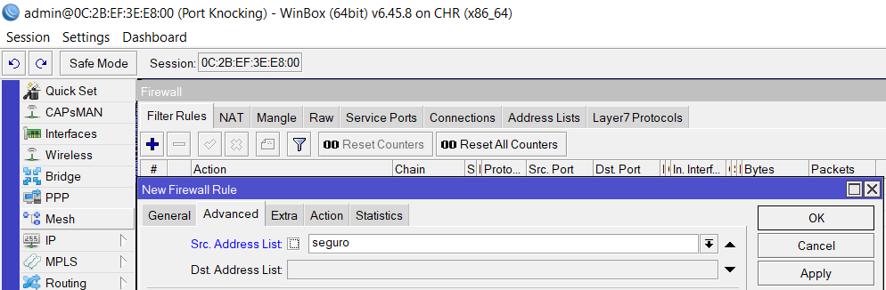

Luego vamos a la pestaña de _Action_, donde el apartado de _Action_ lo dejamos en __accept__.
Aplicamos y OK.

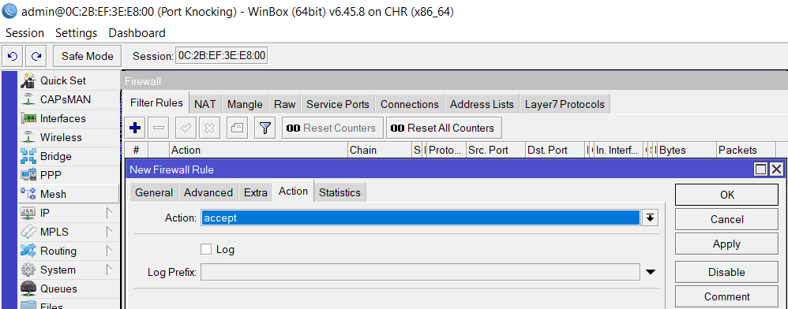

Con esta regla hemos definido que todas aquellas ip, que hayan pasado las tres reglas anteriores tendrán permiso para entrar al router.
 
Por último crearemos una regla la cual impida que cualquier ip que no cumpla estas condiciones pueda entrar al router.
Para ello creamos una nueva regla, donde en la pestaña de _General_ definimos __Input__ en el apartado de _Chain_ y nuestra lista de __WAN__ en el apartado de _In Interface List_

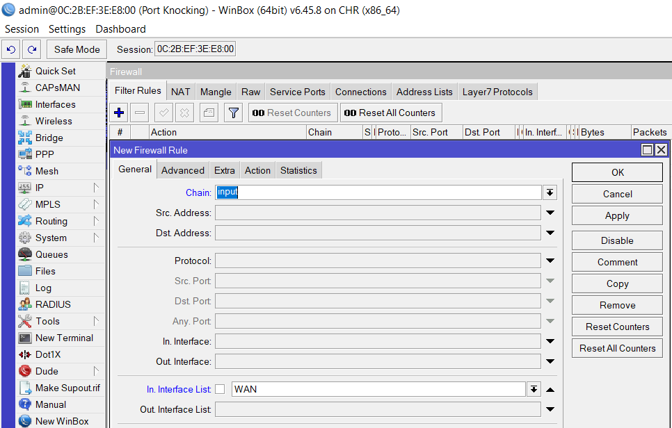

Luego vamos a la pestaña de _Action_ y definimos __drop__ en el apartado de _Action_.
Aplicamos y OK.

Al final nos deben quedar las cinco reglas creadas como en la imagen siguiente.
Cumpliendo con lo definido en el diagrama de red.

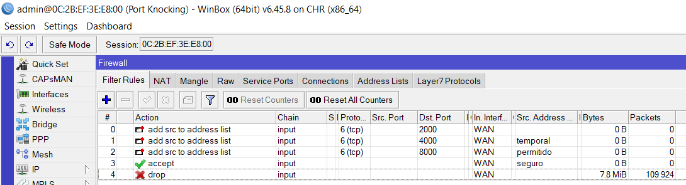

## Crear Address List

A aparte del Port Knocking, podemos crear nosotros las address lists manualmente definiendo qué ip consideramos seguras para poder entrar en el router. 
Para ello tan solo tenemos que ir a la pestaña de _Address Lists_ dentro dentro de la ventana de __Firewall__ y una vez aquí darle al símbolo del (+).
En la ventana que nos aparece le damos un nombre a la lista de direcciones, agregamos la ip que vamos a permitir acceder al router y tambien si queremos podemos definir o no el tiempo que estará dentro de esta lista. 
Con esto podemos agregar todas las ip que queramos en una address list en concreto o crear una address list por ip, según más nos convenga.

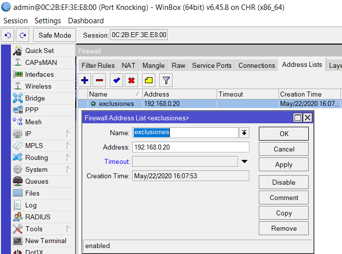

Una vez que tengamos definidas nuestras address list tan solo debemos crear una regla de firewall en la que permitamos el acceso a estas listas, definiendolo en la pestaña de _advanced_ y seleccionar las _addres list_ que deseamos de las creadas antes en el apartado de __Src. Address List__. 

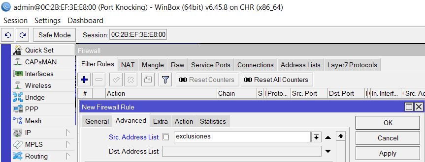

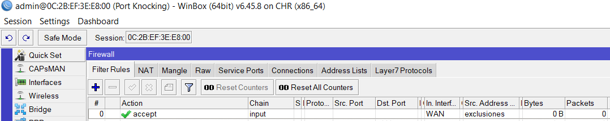

## Configurar Gmail en Mikrotik

Lo primero es saber la ip de nuestro servicio de correo de gmail, y el puerto, para eso podemos ir al siguiente enlace [SMTP gmail](https://support.google.com/a/answer/176600?hl=es).
Y nos fijamos en el siguiente apartado que se muestra en la imagen.

Lo más interesante de aquí son los puertos __(465 y 587)__ y la dirección del servidor smtp __smtp.gmail.com__.
Ahora pasamos a nuestro router mikotik, abrimos una terminal y hacemos ping a esa dirección de smtp, para saber la ip del mismo

Apuntamos la ip que nos aparece porque nos servirá más adelante.
Con esto ya tenemos el puerto y la ip.
Ahora para dar más seguridad iremos a la siguiente página [Contraseña de aplicaciones](https://support.google.com/accounts/answer/185833?hl=es-419) y seguiremos los pasos para crear contraseñas de aplicaciones.

Una vez dentro del apartado de contraseña de aplicación, vamos al apartado que dice _Seleccionar Aplicación_, marcamos otro, y escribimos por ejemplo _Router Mikortik_ o lo que cada uno vea mejor, y luego le damos a __Generar__.

Apuntamos la contraseña que nos dan de 16 dígitos después de darle al botón de generar.

Ahora tenemos todo lo necesario. Así que pasamos a nuestro router Mikrotik.
Una vez en el router vamos al menú izquierdo donde dice __Tools → Email__
y en la ventana que nos aparece escribimos lo siguiente en cada apartado.
- __Server:__ ip de nuestro servicio de smtp
- __Port:__ el puerto que vamos a usar
- __Start Tls:__ hace referencia al transporte criptográfico de seguridad
- __From:__ nuestro correo electrónico
- __User:__ el usuario al cual va dirigido, funciona mejor si dejamos nuestro correo al igual que en _from_
- __Password:__ la contraseña que nos dio google en el apartado de contraseña de aplicaciones. Aunque también se puede usar la propia contraseña de nuestro correo electronico, pero de esta manera no es tan segura ni fiable.
Aplicamos y ok.

Un dato a tener en cuenta para que funcione correctamene el envio de correos es tener activo nuestro servicio SNTP (Server Network Time Protocol) activado, para ello vamos a __System → SNTP client__.
En la ventana que nos aparece marcamos la casilla de _Enabled_, y en _Primary NTP Server_ escribimos __time.google.com__, luego le damos al botón de Apply y automáticamente nos reconocerá la ip de este servicio (siempre que tengamos bien configurado nuestro DNS), rellenando automáticamente lo necesario, así que le damos a OK.

## Configurar que nos lleguen errores y dhcp por correo

Una vez configurado nuestro servicio de correo en Mikrotik vamos a definir que queremos que nos envíe por email, para ellos vamos a __System → Logging__
Una vez aquí vamos primero a la pestaña de _Actions_, y le damos al simbolo del (+).

En la ventanita que nos aparece, definimos el nombre de la acción en _Name_ por ejemplo __email__, definimos de que tipo será en _Type_ el cual será __email__, activamos la casilla _Start TLS_ y en el apartado _Email_ definimos el correo al cual será enviado, aplicamos y ok.

Ya nos deberá aparecer nuestra acción creada.

Acto seguido vamos a la pestaña de _Rules_ y le damos al símbolo del (+)

En la ventana que nos aparece en donde dice _Action_ seleccionamos la acción que previamente creamos como __email__, y en _Topics_ nos saldrá un desplegable con una gran cantidad de opciones donde podemos elegir la que deseemos, en este caso seleccionaremos __error__, luego le damos a aplicar y ok.

Con esta regla cada vez que se produzca un error en el router, nos será notificado al correo que definimos en la _Action_, de esta manera podemos crear todas las reglas que queramos definiendo qué aspectos queremos que se nos comuniquen por correo. 
En este ejemplo aparte de los errores se creó otra regla para el dhcp como se muestra a continuación.

## Configurar que nos lleguen archivox Backup por correo

También podemos configurar el router Mikrotik para que nos envíe automáticamente cada cierto tiempo un archivo de respaldo de la configuración del router.
Para ello usaremos los siguientes scripts.

Cada script corresponde a uno de los dos tipos de respaldo que puede crear Mikrotik.
 
- El __Binario__ es un respaldo total de la configuración del router, el cual guarda tanto los usuario como las contraseñas del mismo, está pensado para usarse en el mismo router cuando haya algún tipo de error, el tipo de texto esta en binario con lo cual si intentamos abrirlo está todo cifrado, siendo ilegible y solo reconocible por dispositivos mikrotik.
- El __Export__ puede ser un respaldo total o parcial de la configuración del router, el cual es un script de texto plano que no guarda ni los usuarios ni las contraseñas.

Pues una vez explicado eso, abrimos una terminal desde el router y copiamos uno de los dos script, lo pegamos en la terminal y le damos a _Intro_ para ejecutarlo, luego realizamos el mismo procedimiento con el otros script.

Una vez ejecutado ambos script en la terminal vamos al menú izquierdo y luego a __System → Script__, en la ventana de _Script List_ nos deberá de aparecer dos archivos los cuales corresponden a los dos script ejecutados antes.

Ahora deberemos de hacer algunas modificaciones a los dos script, hacemos doble clic por ejemplo en el _respaldobinario_ y buscamos la siguiente línea (/tool e-mail send to="youremail@yourdomain.com") en el cuadro de texto de abajo 
de la ventana, en esa línea debemos modificar lo que está entre comillas y agregar el correo al cual queremos que llegue el backup. 
También podemos fijarnos en la siguiente linea (subject=([/system identity get name]), esta línea hace referencia al nombre que le hayamos definido al router en __System Identity__, por lo tanto es bueno definir un nombre para cada router, no solo para identificarlo, sino para cuando nos llegue este correo sepamos a qué router hace referencia.

Una vez cambiado el correo en ambos script pasamos a configurar el envío programado de los mismos, para ellos vamos al menú izquierdo, __System → Scheduler__ y luego al símbolo del (+).

En la nueva ventana que nos aparece definiremos cuando se inicia y cada cuanto tiempo se ejecuta el script.
Por tanto en cada apartado configuraremos lo siguiente:
- __Name:__ Damos el nombre que queramos para definirlo
- __Start Date:__ Es la fecha en la cual empezará a ejecutarse esta tarea
- __Start Time:__ Es la hora de inicio en la cual emepazará a ejecutarse la tarea
- __Interval:__ Es el intervalo de tiempo, para que se ejecute nuevamente la tarea, es este ejemplo se a definido que sea una vez al dia es decir cada 24 horas
- __Owner:__ Hace referencia al propietario de la creación de la tarea, este aparece automáticamente al darle al botón _Apply_
- Las __Policies__ las podemos dejar por defecto todas marcadas
En el cuadro de texto de abajo escribimos el nombre del uno de los script que previamente creamos, para definir qué será eso lo que deberá ejecutar en el tiempo definido
Los demas campos se rellenan solos al darle al botón de _Apply_ le damos al OK para terminar.
Seguidamente creamos otra regla con el mismo tiemppo o distinto segun prefiramos para el otro script de respaldo el de __respaldoexport__.

Al final nos quedarán ambas reglas creadas como en la imagen siguiente.

