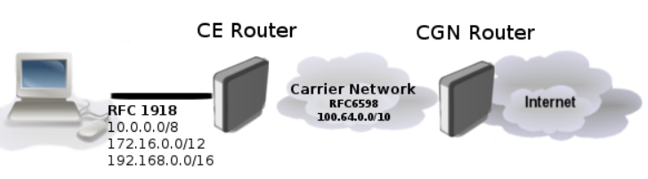

[Inicio](https://franciscocadena.github.io/PI-Mikrotik/)

# Definiciones

## Drop vs Reject

Para paquetes que vengan del exterior lo recomendable es usar _DROP_, para los paquetes dentro de una red Local o privada puede usarse _Reject_.
La opción REJECT envía un mensaje ICMPP avisando que fue rechazada, sin embargo esto puede ser usado por otras personas que realicen un ataque DDOS (denegación de servicios). Muchos de estos ataques son falsificaciones, que se aprovechan de la ventaja de REJECT vs DROP. 

## Port knocking

El bloqueo de puertos es un método que permite el acceso al enrutador solo después de recibir intentos de conexión secuenciados en un conjunto de puertos cerrados previamente especificados. Una vez que se recibe la secuencia correcta de los intentos de conexión, el RouterOS agrega dinámicamente una IP de origen del host a la lista de direcciones permitidas y podrá conectar su enrutador.

Mejora la seguridad de nuestro dispositivo y minimizar el riesgo de intentos de piratería en protocolos como SSH, Telnet, Winbox, etc.

## Expresión regular

Las expresiones regulares son patrones utilizados para encontrar una determinada combinación de caracteres dentro de una cadena de texto. Las expresiones regulares proporcionan una manera muy flexible de buscar o reconocer cadenas de texto. Por ejemplo, el grupo formado por las cadenas Handel, Händel y Haendel se describe con el patrón `"H(a|ä|ae)ndel"`.

## IPsec

Internet Protocol Security (IPsec) es un conjunto de protocolos definidos por Internet Engineering Task Force (IETF) para asegurar el intercambio de paquetes a través de redes IP / IPv6 desprotegidas como Internet.El conjunto de protocolos IPsec se puede dividir en los siguientes grupos:

- __Protocolos de intercambio de claves de Internet (IKE)__. Genera y distribuye dinámicamente claves criptográficas para AH y ESP.

Es un protocolo que proporciona material de claves autenticado para el marco de la Asociación de seguridad de Internet y el Protocolo de administración de claves (ISAKMP). Existen otros esquemas de intercambio de claves que funcionan con ISAKMP, pero IKE es el más utilizado. Juntos proporcionan medios para la autenticación de hosts y la gestión automática de asociaciones de seguridad (SA).

- __Encabezado de autenticación (AH) RFC 4302__

Es un protocolo que proporciona autenticación de todo o parte del contenido de un datagrama mediante la adición de un encabezado que se calcula en función de los valores en el datagrama. Las partes del datagrama que se usan para el cálculo y la ubicación del encabezado dependen de si se usa el modo túnel o transporte.

La presencia del encabezado AH permite verificar la integridad del mensaje, pero no lo encripta. Por lo tanto, AH proporciona autenticación pero no privacidad. Otro protocolo (ESP) se considera superior, proporciona privacidad de datos y también su propio método de autenticación.

- __Carga de seguridad de encapsulación (ESP) RFC 4303__

Utiliza cifrado de clave compartida para proporcionar privacidad de datos. ESP también admite su propio esquema de autenticación como el utilizado en AH.

ESP empaqueta sus campos de una manera muy diferente a AH. En lugar de tener solo un encabezado, divide sus campos en tres componentes:

- _Encabezado ESP_: viene antes de los datos cifrados y su ubicación depende de si ESP se usa en modo de transporte o en túnel.
- _ESP Trailer_: esta sección se coloca después de los datos cifrados. Contiene relleno que se utiliza para alinear los datos cifrados.
- _Datos de autenticación ESP_: este campo contiene un valor de comprobación de integridad (ICV), calculado de manera similar a cómo funciona el protocolo AH, para cuando se utiliza la función de autenticación opcional de ESP.

## Datagramas

Paquete sencillo enrutado en una red sin reconocimiento.

Un __datagrama__ es un fragmento de paquete que es enviado con la suficiente información como para que la red pueda simplemente encaminar el fragmento hacia el ordenador receptor, de manera independiente a los fragmentos restantes. Esto puede provocar una recomposición desordenada o incompleta del paquete en el ordenador destino. Su estructura se compone de _cabecera y datos_.

## TZSP

TaZmen Sniffer Protocol (TZSP) es un protocolo de encapsulación utilizado para envolver otros protocolos. Se usa comúnmente para envolver paquetes inalámbricos 802.11 para admitir sistemas de detección de intrusiones (IDS) , seguimiento inalámbrico u otras aplicaciones inalámbricas.
Usa el protocolo _UDP_ y el puerto 37008.

## PCAP

Es una interfaz de una aplicación de programación para captura de paquetes. La implementación del pcap para sistemas basados en Unix se conoce como libpcap; el port para Windows del libpcap recibe el nombre de WinPcap.

Algunos programas que usan pcap:
- Snort
- Suricata
- Nmap
- tcpdump

## Metodo PCC Matcher para el balanceo de carga

Permitirá dividir el tráfico en flujos iguales con la capacidad de mantener paquetes con un conjunto específico de opciones en un flujo particular (puede especificar este conjunto de opciones desde src-address, src-port, dst-address, dst-port)

PCC toma los campos seleccionados del encabezado IP y, con la ayuda de un algoritmo hash, convierte los campos seleccionados en un valor de 32 bits. Este valor se divide por un Denominador especificado y el resto se compara con un Remanente especificado , si es igual, se capturará el paquete. 

## VRRP

Virtual Router Redundancy Protocol (VRRP) es un protocolo de comunicaciones no propietario definido en el RFC 3768 diseñado para aumentar la disponibilidad de la puerta de enlace por defecto dando servicio a máquinas en la misma subred. El aumento de fiabilidad se consigue mediante el anuncio de un router virtual como una puerta de enlace por defecto en lugar de un router físico. Dos o más routers físicos se configuran representando al router virtual, con sólo uno de ellos realizando realmente el enrutamiento. Si el router físico actual que está realizando el enrutamiento falla, el otro router físico negocia para sustituirlo. Se denomina router maestro al router físico que realiza realmente el enrutamiento y routers de respaldo a los que están en espera de que el maestro falle.

## Protocol Layer 7

El protocolo layer7 es un método de búsqueda de patrones en flujos ICMP / TCP / UDP.
Funciona por medio de patrones pre-establecidos en la capa de Aplicación del modelo OSI.

L7 matcher recopila los primeros 10 paquetes de una conexión o los primeros 2 KB de una conexión y busca el patrón en los datos recopilados. Si el patrón no se encuentra en los datos recopilados, el comparador deja de inspeccionar más. La memoria asignada se libera y el protocolo se considera desconocido . Debe tener en cuenta que muchas conexiones aumentarán significativamente el uso de memoria y CPU.

El requisito adicional es que el emparejador de capa 7 debe ver ambas direcciones de tráfico (entrante y saliente). Para cumplir este requisito, las reglas deben establecerse en cadena hacia adelante . Si la regla se encuentra en entrada / prerouting cadena entonces la misma regla debe ser también situado en la salida / POSTROUTING cadena, de lo contrario los datos recogidos no puede ser completo que resulta en un patrón incorrectamente emparejado.

## ISP 

El proveedor de servicios de Internet, (ISP, por las siglas en inglés de Internet service provider) es la empresa que brinda conexión a Internet a sus clientes. Un ISP conecta a sus usuarios a Internet a través de diferentes tecnologías como ADSL, cablemódem, GSM, dial-up, etc.

## CGNAT (Carrier-Grade NAT o NAT444)

La idea es utilizar el espacio de direcciones compartido 100.64.0.0/10 dentro de la red del operador y realizar NAT en el enrutador de borde del operador para indicar IP pública o rango de IP pública. Lo que ocurre es que en lugar de hacer una vez NAT, hacen NAT dos veces.

## Gateway

La pasarela (en inglés gateway ) o puerta de enlace es el dispositivo que actúa de interfaz de conexión entre aparatos o dispositivos, y también posibilita compartir recursos entre dos o más ordenadores.

Su propósito es traducir la información del protocolo utilizado en una red inicial, al protocolo usado en la red de destino.

La pasarela es normalmente un equipo informático configurado para dotar a las máquinas de una red de área local (Local Area Network, LAN) conectadas a él de un acceso hacia una red exterior, generalmente realizando para ello operaciones de traducción de direcciones de red (Network Address Translation, NAT). Esta capacidad de traducción de direcciones permite aplicar una técnica llamada enmascaramiento de IP , usada muy a menudo para dar acceso a Internet a los equipos de una LAN compartiendo una única conexión a Internet, y por tanto, una única dirección IP externa.

## RoMON (Router Manager Overlay Network)

Protocolo propietario de Mikrotik, no activo por defecto, el cual permite enlazar y acceder a dispositivos routerOS que se encuentren tanto en capa 2 (bridge) como en capa 3 (ruteada) con versión 6.28 o superior en una red a través de winbox v3.x. Solo se necesita activar este protocolo en los routerOs que se deseen acceder

[Inicio](https://franciscocadena.github.io/PI-Mikrotik/)
