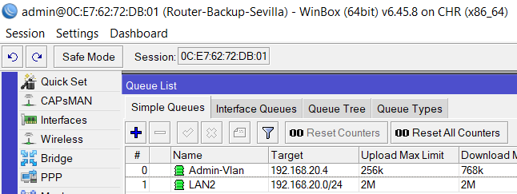

[Inicio](https://franciscocadena.github.io/PI-Mikrotik/)

# Fase 2 con GNS3

En este apartado se verá la configuración de todos los router usando gns3,  según la siguiente imagen, que corresponde a la Fase 2 del proyecto.

Como se puede observar en la imagen anterior, la topografía de red ha sido simplificada con respecto a lo visto del diagrama de la fase 2 del apartado [Planificación de la Red Empresarial](./Planificación_de_la_Red_de_una_empresa.md).

Esto es debido porque a la hora de simular dos proveedores de internet, no es posible hacerlo usando solo la red que te da tu propio router de casa, por ello como sustitución de los dos ISP se a usado todos los interfaces que se pueden incorporar a la _OVA de GNS3_ que está siendo virtualizado por _Virtualbox_.

Esto quiere decir que todas las _nubes_ que se ven en el diagrama corresponden a la _ova de gns3_, el cual consta de __tres interfaces__, uno en modo anfitrión, otro en modo Nat y el último en modo Bridge, usando estos dos últimos que tienen salida a internet como si fuesen dos ISP.

También se a _simplificado las vlan_, porque sabiendo configurar dos, se sabe configurar todas las que se quieran, con ello es más fácil de entender y simplificar las reglas que tendrán cada router.

Cabe también destacar que el Router que está en la red de las vlan, es un Switch siendo simulado con el sistema operativo RouterOS, de hay que la imagen sea como la de un router.
 
A continuación se mostrará la configuración de cada uno de los router, para esta topografía de red donde ya tienen incorporado las herramientas de Alta disponibilidad que se explicaron en el documento de [Configuración de Herramientas de alta Disponibilidad](./Configuración_Herramientas_Alta_Disponibilida.md).
De hay que solo se muestre la configuración final, sin entrar en detalles de como configurarlos.

## Router Sede Madrid

### Quick Set

Se puede observar, que el router de la sede de Madrid tan solo trabaja con dos interfaces una WAN con ip estática, y una red LAN.

### Nat

Esta sería la regla de enmascaramiento y la regla que permite la navegación de la red lan de la sede de madrid con la red lan de la sede de sevilla por el vpn configurado.

### Routes List

La siguiente imagen corresponde a las rutas creadas para la wan y para la lan.

### VPN IPsec

A Continuación se muestra la reglas configuradas para la creación del vpn con los dos router de la sede de sevilla.
 
Lo primero son los __Peer (vecinos)__.

En la siguiente imagen vemos las __Policies (Políticas)__ para cada vecino, donde se puede observar que uno de ellos está en _rojo_, ese corresponde al _router backup de la sede de sevilla_, con lo que si se pierde la conexión vpn con el router principal de sevilla, saltaría la conexión de vpn con el router backup de sevilla.

Por último se ve en la siguiente imagen la conexión establecida con los vecinos activos donde se ve que se ha establecido conexión de _iniciador y respondedor_ con ambos router de sevilla.

## Router Master Sevilla

Ahora pasamos a ver la configuración del router principal de la sede de sevilla.

### Interfaces

Lo primero es ver las interfaces que tiene, en donde se ve por el nombre dado que tiene _tres interfaces que van por WAN_, las interfaces que van a las respectivas _redes locales (DMZ, LAN2, LAN “VLAN”)_, porque interfaz van las _vlan 10 y 20_,  y los _vrrp_ creados que van a las interfaces cuyo direccionamiento de red local es estático. 

### Dhcp y Dns

En la siguiente imagen se muestra el dns, y los dhcp server creados, los cuales van a las vlan.

### VRRP

En la siguiente imagen se ven los vrrp creados, donde lo más importante aparte del nombre son la _Priority y el VRID_.

### IP de las interfaces

En la siguiente imagen se ve el direccionamiento de cada interfaz, vlan y vrrp.

### VPN por IPsec

Esta sería la configuración de Peer con la sede de Madrid.

Seguidamente vemos la Política asociada.

Y por último el vecino Activo.

### Nat

En la siguiente imagen vemos las reglas de Nat creadas donde en primer lugar está la regla que permite la conexión de las redes locales entre las sedes de Sevilla y Madrid que van por vpn.
Luego el enmascaramiento de las tres interfaces wan.
Y por último las redirecciones de puerto para los servidores.

### Firewall

Estas serían las reglas de firewall, donde no hay muchos cambios con las ya creadas en la Fase 1.

### Mangle (Reglas de Marcado)

En la siguiente imagen se ve las reglas creadas para el balanceo de carga por PCC, donde aunque tengamos tres interfaces WAN, solo se han usado dos de estas para el balanceo, el cual va dirigido para la DMZ.

### Routes List

En la siguiente imagen vemos todas las rutas creadas, en donde se puede ver el __failover__ definido por la _distance_, estos están en color celeste y en modo estático, esperando a que el principal caiga y activarse la siguiente que esté definida.
También se puede ver los dos interfaces que se están usando para el __balanceo de carga__ donde dice _routing mask_ que hacen referencia a que proveedor de internet va cada uno.
Podemos ver también las rutas correspondientes para las _vlan y los vrrp_.

### Ancho de Banda

En esta imagen podemos ver la configuración del _ancho de banda_ el cual consta de dos reglas una definida para toda la red LAN2 y otra que va primero para definir un determinado equipo dentro de la red LAN2.

 del Router Master de Sevilla")

## Router Backup de Sevilla

Ahora pasamos a la configuración del router de respaldo de la sede de sevilla, el cual tendrá reglas muy parecidas al del router master, donde la mayor diferencia será en las ip de las interfaces, y prioridades en los vrrp.

### Interfaces

La distribución y nombre de las interfaces son las mismas que las de router master, la mayor diferencia está en el nombre de las vlan.

### Dhcp y DNS

La única diferencia visible es el nombre de las vlan.

### VRRP

En la VRRP la mayor diferencia radica en la prioridad, está al ser menos pasa a ser la de respaldo, mientras que la de router master al tener un número mayor pasa a ser el principal, el VRID y la ip deben ser idénticos a los que se definió en el router master.

### IP de las Interfaces

En las ip de las interfaces es donde se aprecia la mayor diferencia de ambos routers, se puede apreciar el color rojo de los vrrp, esto es debido a que están de respaldo, es decir están a la espera de que si se cae el router master estas pasarían a estar activas.

### VPN por IPsec

Configuración de la vpn en el Router Backup de Sevilla.

Pestaña Peer del Router Backup de Sevilla.

Pestaña Policies del Router Backup de Sevilla.

Pestaña Active Peer del Router Backup de Sevilla.

### NAT

Reglas Nat del Router Backup de Sevilla

### Firewall

Reglas Firewall del Router Backup de Sevilla

### Mangle

Reglas de Marcado del Router Backup de Sevilla

### Routes List

En la lista de rutas del router backup de Sevilla, apenas se ven diferencia con el maestro, pero hay un detalle y es que no aparecen las rutas para las vrrp, esto es debido a que no están activas, si el router master se dañase por algún motivo, se activarán los vrrp de respaldo y entonces si aparecen las rutas de estos en el router backup. 

### Ancho de Banda

Reglas Queues del Router Backup de Sevilla

## Switch simulado por RouterOS

Por último veremos la configuración que tiene el _Switch_ de la red LAN donde están la vlans, el cual a sido simulado usando también el sistema operativo _RouterOS_, de hay que la imagen sea la de un router en vez de la de un Switch.

La primera imagen hace referencia al __Quick Set__ o configuración inicial, donde lo más destacable de aquí es donde dice _Mode_ que está activa la opción de _Bridge_ en vez de la de router como en todos los demás router configurados. 
También se puede apreciar que el direccionamiento de este es _dinámico_ y no requiere de _DNS_.

La siguiente imagen hace referencia a los diferentes _Bridges_ que se han creado en el Switch.
A diferencia de la _Fase 1_ donde el mismo router creaba las vlan, le daba direccionamiento y los repartía por los puertos. 
En esta fase se ha configurado de una manera más real, en donde los router master y backup tienen creadas las vlan, le dan un direccionamiento por Dhcp Server y definen porque interfaz salen, y el Switch por enlace troncal recibe esas vlan, las cuales también están creadas en el Switch, pero también tiene creadas los bridges para posteriormente definir por qué puerto ira cada vlan.

En la siguiente imagen se puede ver la asignación de cada interfaz con su bridge, donde podemos observar lo siguiente:
- Los dos interfaces WAN están en un mismo Bridge, esto será para luego definirlo en una Ruta de respaldo.
- Se puede ver las vlan definidas en el router master y el backup, que pertenecen a un mismo Bridge con el reparto de interfaces, con esto aseguramos que si cae el router master las vlan definidas en el router de respaldo las cuales tendrán el mismo direccionamiento que en el mater  ocuparan su lugar.
- Por último se puede ver un reparto de interfaces para cada vlan por medio de los Bridges. 

En la siguiente imagen se ven las interfaces del Switch.
- En donde podemos ver los Bridges creados.
- Las Vlan creadas y vinculadas, cada una a la interfaz que corresponden al router conectado que le proporciona el direccionamiento.
- Y también se pueden ver las interfaces que están en modo _slave (esclavo)_ con la letra __S__, esperando a que se conecte un equipo, y cuales están _running (corriendo)_ definidos por la letra __R__.

Por último vemos las rutas creadas en el Switch, donde se puede observar dos curiosidades:
- El Failover creado en el _Bridge_Lan_, y con gateway diferente, correspondiendo cada uno al router maestro y otro al backup, como ambos interfaces están vinculados con ese bridge, al caer uno se activaria el que está a la espera.
- También podemos ver que no aparecen las rutas de las vlan, eso es porque están en la lista de rutas de ambos router.

[Inicio](https://franciscocadena.github.io/PI-Mikrotik/)

