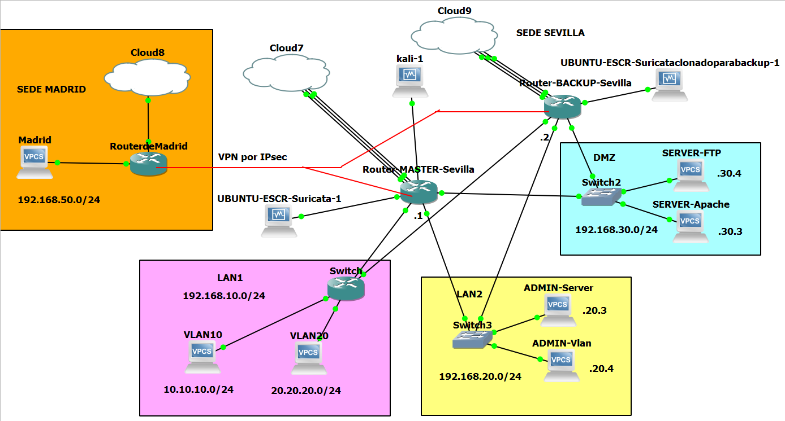

[Inicio](https://franciscocadena.github.io/PI-Mikrotik/)

# Fase 3 con GNS3

En este apartado se muestra con la siguiente imagen como se a virtualizado la Fase 3 con GNS3 que se encuentra en el documento de planificación de red empresarial.

Esta vez en vez de mostrar las imágenes de la configuración final de cada router por winbox, se pasará los script de la configuración, para realizarla desde la terminal.

En esta fase están implementados y corriendo todo lo visto en las fases 1, 2 y 3, en donde los principales cambios han sido en las reglas de cortafuegos.

## Router Madrid

~~~
/interface ethernet
set [ find default-name=ether1 ] disable-running-check=no name=ether1-wan
set [ find default-name=ether2 ] disable-running-check=no name=ether2-D
set [ find default-name=ether3 ] disable-running-check=no
set [ find default-name=ether4 ] disable-running-check=no
set [ find default-name=ether5 ] disable-running-check=no
set [ find default-name=ether6 ] disable-running-check=no name=ether6-lan
/interface list
add name=WAN
add name=LAN
/interface wireless security-profiles
set [ find default=yes ] supplicant-identity=MikroTik
/ip ipsec peer
add address=192.168.0.32/32 local-address=192.168.0.40 name=sede3
add address=192.168.0.31/32 local-address=192.168.0.40 name=sede1
/ip pool
add name=dhcp_pool0 ranges=192.168.50.200-192.168.50.254
add name=dhcp_pool1 ranges=192.168.50.200-192.168.50.254
/ip dhcp-server
add address-pool=dhcp_pool1 disabled=no interface=ether6-lan name=dhcp2
/interface list member
add interface=ether1-wan list=WAN
add list=LAN
/ip address
add address=192.168.50.1/24 interface=ether6-lan network=192.168.50.0
add address=192.168.0.40/24 interface=ether1-wan network=192.168.0.0
/ip dhcp-client
add interface=ether1-wan
add dhcp-options=hostname,clientid interface=ether2-D
/ip dhcp-server network
add address=192.168.40.0/24 dns-server=\
    212.166.132.110,212.166.132.104,8.8.8.8,8.8.4.4 gateway=192.168.40.1
add address=192.168.50.0/24 gateway=192.168.50.1
/ip dns
set servers=8.8.8.8,8.8.4.4
/ip firewall nat
add action=accept chain=srcnat dst-address=192.168.20.0/24 src-address=\
    192.168.50.0/24
add action=masquerade chain=srcnat out-interface=ether1-wan
/ip ipsec identity
add peer=sede1 secret=Tik-academy
add peer=sede3 secret=Mikrotik
/ip ipsec policy
add dst-address=192.168.20.0/24 peer=sede1 sa-dst-address=192.168.0.31 \
    sa-src-address=192.168.0.40 src-address=192.168.50.0/24 tunnel=yes
add dst-address=192.168.20.0/24 peer=sede3 sa-dst-address=192.168.0.32 \
    sa-src-address=192.168.0.40 src-address=192.168.50.0/24 tunnel=yes
/ip route
add check-gateway=ping distance=1 gateway=192.168.0.1
/system identity
set name=Router-Madirid
/tool romon
set enabled=yes
~~~

## Router Master Sevilla

~~~
/interface ethernet
set [ find default-name=ether1 ] disable-running-check=no name=ether1-WAN1
set [ find default-name=ether2 ] disable-running-check=no name=ether2-WAN2
set [ find default-name=ether3 ] disable-running-check=no name=ether3-WAN3
set [ find default-name=ether4 ] disable-running-check=no name=ether4-Kali
set [ find default-name=ether5 ] disable-running-check=no name=\
    ether5-Suricata
set [ find default-name=ether6 ] disable-running-check=no
set [ find default-name=ether7 ] disable-running-check=no
set [ find default-name=ether8 ] disable-running-check=no
set [ find default-name=ether9 ] disable-running-check=no
set [ find default-name=ether10 ] disable-running-check=no name=ether10-LAN
set [ find default-name=ether11 ] disable-running-check=no name=ether11-LAN2
set [ find default-name=ether12 ] disable-running-check=no name=ether12-DMZ
/interface vrrp
add interface=ether11-LAN2 name=vrrp2 vrid=20
add interface=ether12-DMZ name=vrrp3 vrid=30
/interface vlan
add interface=ether10-LAN name=vlan10 vlan-id=10
add interface=ether10-LAN name=vlan20 vlan-id=20
/interface list
add name=WAN
add name=LAN
add name=vlanes
/interface wireless security-profiles
set [ find default=yes ] supplicant-identity=MikroTik
/ip firewall layer7-protocol
add name=Bloquear regexp="^.+(youporn.com|pornhub.com|xvideos.com|xvideos|porn\
    stars|youtube.com|youtu.be|googlevideo.com|facebook).*\$"
/ip ipsec peer
add address=192.168.0.40/32 local-address=192.168.0.31 name=sede2
/ip pool
add name=dhcp_pool4 ranges=192.168.4.100-192.168.4.254
add name=dhcp_pool5 ranges=192.168.10.200-192.168.10.254
add name=dhcp_pool6 ranges=10.10.10.200-10.10.10.254
add name=dhcp_pool7 ranges=20.20.20.200-20.20.20.254
/ip dhcp-server
add address-pool=dhcp_pool4 disabled=no interface=ether4-Kali name=dhcp4
add address-pool=dhcp_pool5 disabled=no interface=ether10-LAN name=dhcp1
add address-pool=dhcp_pool6 disabled=no interface=vlan10 name=dhcp2
add address-pool=dhcp_pool7 disabled=no interface=vlan20 name=dhcp3
/queue simple
add max-limit=256k/768k name=Admin-Vlan target=192.168.20.4/32
add max-limit=2M/2M name=Lan2 target=192.168.20.0/24
/system logging action
add email-start-tls=yes email-to=franciscomiguelcadenagarcia@gmail.com name=\
    email target=email
/interface list member
add interface=ether1-WAN1 list=WAN
add list=LAN
add list=LAN
add interface=ether2-WAN2 list=WAN
add interface=ether3-WAN3 list=WAN
add interface=vlan10 list=vlanes
add interface=vlan20 list=vlanes
/ip address
add address=192.168.30.1/24 interface=ether12-DMZ network=192.168.30.0
add address=192.168.20.1/24 interface=ether11-LAN2 network=192.168.20.0
add address=10.10.10.1/24 interface=vlan10 network=10.10.10.0
add address=20.20.20.1/24 interface=vlan20 network=20.20.20.0
add address=192.168.0.31/24 interface=ether1-WAN1 network=192.168.0.0
add address=192.168.1.2/24 interface=ether2-WAN2 network=192.168.1.0
add address=192.168.20.20 interface=vrrp2 network=192.168.20.20
add address=192.168.30.30 interface=vrrp3 network=192.168.30.30
add address=192.168.10.1/24 interface=ether10-LAN network=192.168.10.0
add address=10.0.3.10/24 interface=ether3-WAN3 network=10.0.3.0
add address=192.168.5.1/24 interface=ether5-Suricata network=192.168.5.0
add address=192.168.4.1/24 interface=ether4-Kali network=192.168.4.0
/ip dhcp-client
add interface=ether1-WAN1
add dhcp-options=hostname,clientid interface=ether3-WAN3
/ip dhcp-server network
add address=10.10.10.0/24 dns-server=8.8.8.8,8.8.4.4 gateway=10.10.10.1
add address=20.20.20.0/24 dns-server=8.8.8.8,8.8.4.4 gateway=20.20.20.1
add address=192.168.4.0/24 gateway=192.168.4.1
add address=192.168.10.0/24 gateway=192.168.10.1
/ip dns
set servers=8.8.8.8,8.8.4.4
/ip firewall filter
add action=add-src-to-address-list address-list=temporal \
    address-list-timeout=5m chain=input comment="Reglas de Port Knocking" \
    dst-port=2000 in-interface-list=WAN protocol=tcp
add action=add-src-to-address-list address-list=permitido \
    address-list-timeout=5m chain=input dst-port=4000 in-interface-list=WAN \
    protocol=tcp src-address-list=temporal
add action=add-src-to-address-list address-list=seguro address-list-timeout=\
    1h chain=input dst-port=8000 in-interface-list=WAN protocol=tcp \
    src-address-list=permitido
add action=accept chain=input src-address-list=seguro
add action=drop chain=forward comment="Filtro de paquetes de L7" packet-mark=\
    bloquear_packet
add action=drop chain=input packet-mark=bloquear_packet
add action=accept chain=forward comment="Permitir HTTP y HTTPS" dst-port=80 \
    protocol=tcp
add action=accept chain=output dst-port=80 out-interface-list=WAN protocol=\
    tcp
add action=accept chain=input in-interface-list=WAN protocol=tcp src-port=80
add action=accept chain=forward dst-port=8080 protocol=tcp
add action=accept chain=output dst-port=8080 protocol=tcp
add action=accept chain=input in-interface-list=WAN protocol=tcp src-port=\
    8080
add action=accept chain=forward dst-port=443 protocol=tcp
add action=accept chain=output dst-port=443 out-interface-list=WAN protocol=\
    tcp
add action=accept chain=input in-interface-list=WAN protocol=tcp src-port=443
add action=accept chain=forward comment="Permitir entrada por FTP" dst-port=\
    21 protocol=tcp
add action=accept chain=output dst-port=21 out-interface-list=WAN protocol=\
    tcp
add action=accept chain=input in-interface-list=WAN protocol=tcp src-port=21
add action=accept chain=forward comment="Permitir DNS" dst-port=53 protocol=\
    udp src-port=53
add action=accept chain=output dst-port=53 out-interface-list=WAN protocol=\
    udp
add action=accept chain=input in-interface-list=WAN protocol=udp src-port=53
add action=accept chain=output comment="Permitir ICMP" out-interface-list=WAN \
    protocol=icmp
add action=accept chain=input in-interface-list=WAN protocol=icmp
add action=accept chain=forward comment=\
    "Permitir conexiones entre Admin-Server y DMZ" dst-address=192.168.30.3 \
    dst-port=80 protocol=tcp src-address=192.168.20.3
add action=accept chain=forward dst-address=192.168.30.3 dst-port=8080 \
    protocol=tcp src-address=192.168.20.3
add action=accept chain=forward dst-address=192.168.30.3 dst-port=443 \
    protocol=tcp src-address=192.168.20.3
add action=accept chain=forward dst-address=192.168.30.4 dst-port=21 \
    protocol=tcp src-address=192.168.20.3
add action=accept chain=forward dst-port=22 protocol=tcp src-address=\
    192.168.20.3
add action=accept chain=forward dst-address=192.168.30.3 protocol=icmp \
    src-address=192.168.20.3
add action=accept chain=forward dst-address=192.168.30.4 protocol=icmp \
    src-address=192.168.20.3
add action=accept chain=forward dst-address=192.168.20.3 protocol=icmp \
    src-address=192.168.30.3
add action=accept chain=forward dst-address=192.168.20.3 protocol=icmp \
    src-address=192.168.30.4
add action=accept chain=forward comment=\
    "Permitir conexiones relacionadas y establecidas" connection-state=\
    established,related protocol=tcp
add action=accept chain=forward comment=\
    "Permitir conexiones entre Admin-LAN y LAN1 " in-interface=ether11-LAN2 \
    out-interface=ether10-LAN src-address=192.168.20.4
add action=accept chain=forward dst-address=192.168.20.4 in-interface=\
    ether10-LAN out-interface=ether11-LAN2
add action=accept chain=forward dst-address=10.10.10.0/24 src-address=\
    192.168.20.4
add action=accept chain=forward dst-address=20.20.20.0/24 src-address=\
    192.168.20.4
add action=accept chain=forward dst-address=192.168.20.4 src-address=\
    10.10.10.0/24
add action=accept chain=forward dst-address=192.168.20.4 src-address=\
    20.20.20.0/24
add action=drop chain=forward comment=\
    "Negar el resto de conexiones entre LAN2  y DMZ" dst-address=\
    192.168.30.0/24 src-address=192.168.20.0/24
add action=reject chain=forward in-interface=ether12-DMZ out-interface=\
    ether11-LAN2 reject-with=icmp-network-unreachable
add action=reject chain=forward comment=\
    "negar el resto de conexiones entre LAN2  y Vlanes" in-interface=\
    ether11-LAN2 out-interface-list=vlanes reject-with=\
    icmp-network-unreachable
add action=reject chain=forward in-interface-list=vlanes out-interface=\
    ether11-LAN2 reject-with=icmp-network-unreachable
add action=reject chain=forward comment=\
    "Negar conexiones entre DMZ  y Vlanes" in-interface=ether12-DMZ \
    out-interface-list=vlanes reject-with=icmp-network-unreachable
add action=reject chain=forward in-interface-list=vlanes out-interface=\
    ether12-DMZ reject-with=icmp-network-unreachable
add action=drop chain=forward comment="Negar conexiones entre vlanes" \
    dst-address=20.20.20.0/24 src-address=10.10.10.0/24
add action=drop chain=forward dst-address=10.10.10.0/24 src-address=\
    20.20.20.0/24
add action=drop chain=input comment="Denegar por Defecto" protocol=udp \
    src-port=!500,4500
add action=drop chain=output protocol=tcp src-port=!22,8291
add action=drop chain=output dst-port=!500,4500 protocol=udp
/ip firewall mangle
add action=sniff-tzsp chain=forward comment="Envio de trafico al IDS" \
    sniff-target=192.168.5.3 sniff-target-port=37008
add action=mark-connection chain=prerouting comment=\
    "Marcado de conexiones L7" connection-mark=no-mark dst-port=53 \
    layer7-protocol=Bloquear new-connection-mark=bloquear_con passthrough=yes \
    protocol=udp
add action=mark-packet chain=prerouting comment="Marcado de Paquetes de L7" \
    connection-mark=bloquear_con new-packet-mark=bloquear_packet passthrough=\
    yes
add action=accept chain=prerouting comment=\
    "Reglas de balanceo de carga para la DMZ" dst-address=192.168.0.0/24 \
    in-interface=ether12-DMZ
add action=accept chain=prerouting dst-address=10.0.3.0/24 in-interface=\
    ether12-DMZ
add action=mark-connection chain=prerouting connection-mark=no-mark \
    in-interface=ether1-WAN1 new-connection-mark=isp1_p passthrough=yes
add action=mark-connection chain=prerouting connection-mark=no-mark \
    in-interface=ether3-WAN3 new-connection-mark=isp3_t passthrough=yes
add action=mark-connection chain=prerouting connection-mark=no-mark \
    dst-address-type=!local in-interface=ether12-DMZ new-connection-mark=\
    isp1_p passthrough=yes per-connection-classifier=both-addresses:2/0
add action=mark-connection chain=prerouting connection-mark=no-mark \
    dst-address-type=!local in-interface=ether12-DMZ new-connection-mark=\
    isp3_t passthrough=yes per-connection-classifier=both-addresses:2/1
add action=mark-routing chain=prerouting connection-mark=isp1_p in-interface=\
    ether12-DMZ new-routing-mark=para_isp1 passthrough=yes
add action=mark-routing chain=prerouting connection-mark=isp3_t in-interface=\
    ether12-DMZ new-routing-mark=para_isp3 passthrough=yes
add action=mark-routing chain=output connection-mark=isp1_p new-routing-mark=\
    para_isp1 passthrough=yes
add action=mark-routing chain=output connection-mark=isp3_t new-routing-mark=\
    para_isp3 passthrough=yes
/ip firewall nat
add action=accept chain=srcnat comment="Permitir VPN entre redes" \
    dst-address=192.168.50.0/24 src-address=192.168.20.0/24
add action=accept chain=srcnat protocol=udp src-port=500,4500
add action=masquerade chain=srcnat comment=Enmascaramiento \
    out-interface-list=WAN
add action=dst-nat chain=dstnat comment="Redireccion de Puerto HTTP" \
    dst-port=80 in-interface-list=WAN protocol=tcp to-addresses=192.168.30.3
add action=dst-nat chain=dstnat dst-port=443 in-interface-list=WAN protocol=\
    tcp to-addresses=192.168.30.3
add action=dst-nat chain=dstnat dst-port=8080 in-interface-list=WAN protocol=\
    tcp to-addresses=192.168.30.3
add action=dst-nat chain=dstnat comment="Redireccion de Puertos FTP" \
    dst-port=21 in-interface-list=WAN protocol=tcp to-addresses=192.168.30.4
/ip ipsec identity
add peer=sede2 secret=Tik-academy
/ip ipsec policy
add dst-address=192.168.50.0/24 peer=sede2 sa-dst-address=192.168.0.40 \
    sa-src-address=192.168.0.31 src-address=192.168.20.0/24 tunnel=yes
/ip route
add check-gateway=ping distance=1 gateway=192.168.0.1 routing-mark=para_isp1
add check-gateway=ping distance=1 gateway=10.0.3.2 routing-mark=para_isp3
add check-gateway=ping distance=1 gateway=192.168.0.1
add check-gateway=ping distance=2 gateway=10.0.3.2
add distance=3 gateway=192.168.1.1
/system clock
set time-zone-name=Europe/Madrid
/system identity
set name=Router-Master-Sevilla
/system logging
add action=email disabled=yes topics=error
add action=email disabled=yes topics=dhcp
/system ntp client
set enabled=yes primary-ntp=216.239.35.4 secondary-ntp=130.206.3.166
/system scheduler
add interval=1d name=Respaldo_Binario on-event=respaldo_binario policy=\
    ftp,reboot,read,write,policy,test,password,sniff,sensitive,romon \
    start-date=jun/05/2020 start-time=12:00:00
add interval=1d name=Respaldo_Export on-event=respaldo_export policy=\
    ftp,reboot,read,write,policy,test,password,sniff,sensitive,romon \
    start-date=jun/05/2020 start-time=13:00:00
/system script
add dont-require-permissions=no name=respaldo_binario owner=admin policy=\
    ftp,reboot,read,write,policy,test,password,sniff,sensitive,romon source="/\
    system backup save name=([/system identity get name] . \"-\" . \\\
    \n[:pick [/system clock get date] 7 11] . [:pick [/system clock get date] \
    0 3] . [:pick [/system clock get date] 4 6]); \\\
    \n/tool e-mail send to=\"franciscomiguelcadenagarcia@gmail.com\" subject=(\
    [/system identity get name] . \" Backup \" . \\\
    \n[/system clock get date]) file=([/system identity get name] . \"-\" . [:\
    pick [/system clock get date] 7 11] . \\\
    \n[:pick [/system clock get date] 0 3] . [:pick [/system clock get date] 4\
    \_6] . \".backup\"); :delay 10; \\\
    \n/file rem [/file find name=([/system identity get name] . \"-\" . [:pick\
    \_[/system clock get date] 7 11] . \\\
    \n[:pick [/system clock get date] 0 3] . [:pick [/system clock get date] 4\
    \_6] . \".backup\")]; \\\
    \n:log info (\"System Backup emailed at \" . [/sys cl get time] . \" \" . \
    [/sys cl get date])"
add dont-require-permissions=no name=respaldo_export owner=admin policy=\
    ftp,reboot,read,write,policy,test,password,sniff,sensitive,romon source="/\
    export file=([/system identity get name] . \"-\" . \\\
    \n[:pick [/system clock get date] 7 11] . [:pick [/system clock get date] \
    0 3] . [:pick [/system clock get date] 4 6]); \\\
    \n/tool e-mail send to=\"franciscomiguelcadenagarcia@gmail.com\" subject=(\
    [/system identity get name] . \" Backup \" . \\\
    \n[/system clock get date]) file=([/system identity get name] . \"-\" . [:\
    pick [/system clock get date] 7 11] . \\\
    \n[:pick [/system clock get date] 0 3] . [:pick [/system clock get date] 4\
    \_6] . \".rsc\"); :delay 10; \\\
    \n/file rem [/file find name=([/system identity get name] . \"-\" . [:pick\
    \_[/system clock get date] 7 11] . \\\
    \n[:pick [/system clock get date] 0 3] . [:pick [/system clock get date] 4\
    \_6] . \".rsc\")]; \\\
    \n:log info (\"System Backup emailed at \" . [/sys cl get time] . \" \" . \
    [/sys cl get date])"
/tool e-mail
set address=173.194.76.108 from=franciscomiguelcadenagarcia@gmail.com \
    password=ddgiqcvsmccghwmp port=587 start-tls=yes user=\
    franciscomiguelcadenagarcia@gmail.com
/tool romon
set enabled=yes
~~~

## Router Backup Sevilla

~~~
/interface ethernet
set [ find default-name=ether1 ] disable-running-check=no name=ether1-WAN1
set [ find default-name=ether2 ] disable-running-check=no name=ether2-WAN2
set [ find default-name=ether3 ] disable-running-check=no name=ether3-WAN3
set [ find default-name=ether4 ] disable-running-check=no
set [ find default-name=ether5 ] disable-running-check=no name=\
    ether5-Suricata
set [ find default-name=ether6 ] disable-running-check=no
set [ find default-name=ether7 ] disable-running-check=no
set [ find default-name=ether8 ] disable-running-check=no
set [ find default-name=ether9 ] disable-running-check=no
set [ find default-name=ether10 ] disable-running-check=no name=ether10-LAN
set [ find default-name=ether11 ] disable-running-check=no name=ether11-LAN2
set [ find default-name=ether12 ] disable-running-check=no name=ether12-DMZ
/interface vrrp
add interface=ether11-LAN2 name=vrrp2 priority=50 vrid=20
add interface=ether12-DMZ name=vrrp3 priority=50 vrid=30
/interface vlan
add interface=ether10-LAN name=vlan10_respaldo vlan-id=10
add interface=ether10-LAN name=vlan20_respaldo vlan-id=20
/interface list
add name=WAN
add name=LAN
add name=vlanes
/interface wireless security-profiles
set [ find default=yes ] supplicant-identity=MikroTik
/ip firewall layer7-protocol
add name=Bloquear regexp="^.+(youporn.com|pornhub.com|xvideos.com|xvideos|porn\
    stars|youtube.com|youtu.be|googlevideo.com|facebook).*\$"
/ip ipsec peer
add address=192.168.0.40/32 local-address=192.168.0.32 name=sede2
/ip pool
add name=dhcp_pool0 ranges=192.168.10.200-192.168.10.254
add name=dhcp_pool1 ranges=10.10.10.200-10.10.10.254
add name=dhcp_pool2 ranges=20.20.20.200-20.20.20.254
add name=dhcp_pool3 ranges=30.30.30.200-30.30.30.254
/ip dhcp-server
add address-pool=dhcp_pool0 disabled=no interface=ether10-LAN name=dhcp1
add address-pool=dhcp_pool1 disabled=no interface=vlan10_respaldo name=dhcp2
add address-pool=dhcp_pool2 disabled=no interface=vlan20_respaldo name=dhcp3
/queue simple
add max-limit=256k/768k name=Admin-Vlan target=192.168.20.4/32
add max-limit=2M/2M name=LAN2 target=192.168.20.0/24
/system logging action
add email-start-tls=yes email-to=franciscomiguelcadenagarcia@gmail.com name=\
    email target=email
/interface list member
add interface=ether1-WAN1 list=WAN
add list=LAN
add interface=ether2-WAN2 list=WAN
add interface=ether3-WAN3 list=WAN
add interface=vlan10_respaldo list=vlanes
add interface=vlan20_respaldo list=vlanes
/ip address
add address=192.168.0.32/24 interface=ether1-WAN1 network=192.168.0.0
add address=192.168.30.2/24 interface=ether12-DMZ network=192.168.30.0
add address=192.168.20.2/24 interface=ether11-LAN2 network=192.168.20.0
add address=192.168.10.2/24 interface=ether10-LAN network=192.168.10.0
add address=10.10.10.2/24 interface=vlan10_respaldo network=10.10.10.0
add address=20.20.20.2/24 interface=vlan20_respaldo network=20.20.20.0
add address=192.168.30.30 interface=vrrp3 network=192.168.30.30
add address=192.168.20.20 interface=vrrp2 network=192.168.20.20
add address=192.168.1.3/24 interface=ether2-WAN2 network=192.168.1.0
add address=10.0.3.11/24 interface=ether3-WAN3 network=10.0.3.0
add address=192.168.6.1/24 interface=ether5-Suricata network=192.168.6.0
/ip dhcp-client
add interface=ether1-WAN1
add dhcp-options=hostname,clientid interface=ether3-WAN3
add dhcp-options=hostname,clientid interface=ether2-WAN2
/ip dhcp-server network
add address=10.10.10.0/24 dns-server=8.8.8.8,8.8.4.4 gateway=10.10.10.2
add address=20.20.20.0/24 dns-server=8.8.8.8,8.8.4.4 gateway=20.20.20.2
add address=192.168.10.0/24 gateway=192.168.10.2
/ip dns
set servers=8.8.8.8,8.8.4.4
/ip firewall filter
add action=add-src-to-address-list address-list=temporal \
    address-list-timeout=5m chain=input comment="Reglas de Port Knocking" \
    dst-port=3000 in-interface-list=WAN protocol=tcp
add action=add-src-to-address-list address-list=permitido \
    address-list-timeout=5m chain=input dst-port=5000 in-interface-list=WAN \
    protocol=tcp src-address-list=temporal
add action=add-src-to-address-list address-list=seguro address-list-timeout=\
    1h chain=input dst-port=7000 in-interface-list=WAN protocol=tcp \
    src-address-list=permitido
add action=accept chain=input in-interface-list=WAN src-address-list=seguro
add action=drop chain=forward comment="Filtro de paquetes de L7" packet-mark=\
    bloquear_packet
add action=drop chain=input packet-mark=bloquear_packet
add action=accept chain=forward comment="Permitir HTTP y HTTPS" dst-port=80 \
    protocol=tcp src-port=80
add action=accept chain=output dst-port=80 out-interface-list=WAN protocol=\
    tcp
add action=accept chain=input in-interface-list=WAN protocol=tcp src-port=80
add action=accept chain=forward dst-port=8080 protocol=tcp src-port=8080
add action=accept chain=output dst-port=8080 out-interface-list=WAN protocol=\
    tcp
add action=accept chain=input in-interface-list=WAN protocol=tcp src-port=\
    8080
add action=accept chain=forward dst-port=443 protocol=tcp src-port=443
add action=accept chain=output dst-port=443 out-interface-list=WAN protocol=\
    tcp
add action=accept chain=input in-interface-list=WAN protocol=tcp src-port=443
add action=accept chain=forward comment="Permitir entrada por FTP" dst-port=\
    21 protocol=tcp src-port=21
add action=accept chain=output dst-port=21 out-interface-list=WAN protocol=\
    tcp
add action=accept chain=input in-interface-list=WAN protocol=tcp src-port=21
add action=accept chain=forward comment="Permitir DNS" dst-port=53 protocol=\
    udp src-port=53
add action=accept chain=output dst-port=53 out-interface-list=WAN protocol=\
    udp
add action=accept chain=input in-interface-list=WAN protocol=udp src-port=53
add action=accept chain=output comment="Permitir icmp" out-interface-list=WAN \
    protocol=icmp
add action=accept chain=input in-interface-list=WAN protocol=icmp
add action=accept chain=forward comment=\
    "Permitir conexiones entre Admin-Server y DMZ" dst-address=192.168.30.3 \
    dst-port=80 protocol=tcp src-address=192.168.20.3
add action=accept chain=forward dst-address=192.168.30.3 dst-port=8080 \
    protocol=tcp src-address=192.168.20.3
add action=accept chain=forward dst-address=192.168.30.3 dst-port=443 \
    protocol=tcp src-address=192.168.20.3
add action=accept chain=forward dst-address=192.168.30.4 dst-port=21 \
    protocol=tcp src-address=192.168.20.3
add action=accept chain=forward dst-address=192.168.30.0/24 dst-port=22 \
    protocol=tcp src-address=192.168.20.3
add action=accept chain=forward dst-address=192.168.30.3 protocol=icmp \
    src-address=192.168.20.3
add action=accept chain=forward dst-address=192.168.30.4 protocol=icmp \
    src-address=192.168.20.3
add action=accept chain=forward dst-address=192.168.20.3 src-address=\
    192.168.30.3
add action=accept chain=forward dst-address=192.168.20.3 src-address=\
    192.168.30.4
add action=accept chain=forward comment=\
    "Permitir conexiones relacionadas y establecidas" connection-state=\
    established,related protocol=tcp
add action=accept chain=forward comment=\
    "Permitir conexiones entre Admin-LAN y LAN1 " in-interface=ether11-LAN2 \
    out-interface=ether10-LAN src-address=192.168.20.4
add action=accept chain=forward dst-address=192.168.20.4 in-interface=\
    ether10-LAN out-interface=ether11-LAN2
add action=accept chain=forward dst-address=10.10.10.0/24 src-address=\
    192.168.20.4
add action=accept chain=forward dst-address=20.20.20.0/24 src-address=\
    192.168.20.4
add action=accept chain=forward dst-address=192.168.20.4 src-address=\
    10.10.10.0/24
add action=accept chain=forward dst-address=192.168.20.4 src-address=\
    20.20.20.0/24
add action=drop chain=forward comment=\
    "Negar el resto de conexiones entre LAN2  y DMZ" dst-address=\
    192.168.30.0/24 src-address=192.168.20.0/24
add action=reject chain=forward in-interface=ether12-DMZ out-interface=\
    ether11-LAN2 reject-with=icmp-network-unreachable
add action=reject chain=forward comment=\
    "negar el resto de conexiones entre LAN2  y Vlanes" in-interface=\
    ether11-LAN2 out-interface-list=vlanes reject-with=\
    icmp-network-unreachable
add action=reject chain=forward in-interface-list=vlanes out-interface=\
    ether11-LAN2 reject-with=icmp-network-unreachable
add action=reject chain=forward comment=\
    "Negar conexiones entre DMZ  y Vlanes" in-interface=ether12-DMZ \
    out-interface-list=vlanes reject-with=icmp-network-unreachable
add action=reject chain=forward in-interface-list=vlanes out-interface=\
    ether12-DMZ reject-with=icmp-network-unreachable
add action=drop chain=forward comment="Negar conexiones entre vlanes" \
    dst-address=20.20.20.0/24 src-address=10.10.10.0/24
add action=drop chain=forward dst-address=10.10.10.0/24 src-address=\
    20.20.20.0/24
add action=drop chain=input comment="Denegar por Defecto" protocol=udp \
    src-port=!500,4500
add action=drop chain=output protocol=tcp src-port=!22,8291
add action=drop chain=output dst-port=!500,4500 protocol=udp
/ip firewall mangle
add action=sniff-tzsp chain=forward comment="Envio de trafico al IDS" \
    sniff-target=192.168.6.3 sniff-target-port=37008
add action=mark-connection chain=prerouting comment=\
    "Marcado de conexiones L7" connection-mark=no-mark dst-port=53 \
    layer7-protocol=Bloquear new-connection-mark=bloquear_con passthrough=yes \
    protocol=udp
add action=mark-packet chain=prerouting comment="Marcado de Paquetes de L7" \
    connection-mark=bloquear_con new-packet-mark=bloquear_packet passthrough=\
    yes
add action=accept chain=prerouting comment=\
    "Reglas de balanceo de carga para la DMZ" dst-address=192.168.0.0/24 \
    in-interface=ether12-DMZ
add action=accept chain=prerouting dst-address=10.0.3.0/24 in-interface=\
    ether12-DMZ
add action=mark-connection chain=prerouting connection-mark=no-mark \
    in-interface=ether1-WAN1 new-connection-mark=isp1_p passthrough=yes
add action=mark-connection chain=prerouting connection-mark=no-mark \
    in-interface=ether3-WAN3 new-connection-mark=isp3_t passthrough=yes
add action=mark-connection chain=prerouting connection-mark=no-mark \
    dst-address-type=!local in-interface=ether12-DMZ new-connection-mark=\
    isp1_p passthrough=yes per-connection-classifier=both-addresses:2/0
add action=mark-connection chain=prerouting connection-mark=no-mark \
    dst-address-type=!local in-interface=ether12-DMZ new-connection-mark=\
    isp3_t passthrough=yes per-connection-classifier=both-addresses:2/1
add action=mark-routing chain=prerouting connection-mark=isp1_p in-interface=\
    ether12-DMZ new-routing-mark=para_isp1 passthrough=yes
add action=mark-routing chain=prerouting connection-mark=isp3_t in-interface=\
    ether12-DMZ new-routing-mark=para_isp3 passthrough=yes
add action=mark-routing chain=output connection-mark=isp1_p new-routing-mark=\
    para_isp1 passthrough=yes
add action=mark-routing chain=output connection-mark=isp3_t new-routing-mark=\
    para_isp3 passthrough=yes
/ip firewall nat
add action=accept chain=srcnat comment="Permitir VPN entre redes" \
    dst-address=192.168.50.0/24 src-address=192.168.20.0/24
add action=accept chain=srcnat protocol=udp src-port=500,4500
add action=masquerade chain=srcnat comment=Enmascaramiento \
    out-interface-list=WAN
add action=dst-nat chain=dstnat comment="Redireccion de Puerto HTTP" \
    dst-port=80 in-interface-list=WAN protocol=tcp to-addresses=192.168.30.3
add action=dst-nat chain=dstnat dst-port=443 in-interface-list=WAN protocol=\
    tcp to-addresses=192.168.30.3
add action=dst-nat chain=dstnat dst-port=8080 in-interface-list=WAN protocol=\
    tcp to-addresses=192.168.30.3
add action=dst-nat chain=dstnat comment="Redireccion de Puertos FTP" \
    dst-port=21 in-interface-list=WAN protocol=tcp to-addresses=192.168.30.4
/ip ipsec identity
add peer=sede2 secret=Mikrotik
/ip ipsec policy
add dst-address=192.168.50.0/24 peer=sede2 sa-dst-address=192.168.0.40 \
    sa-src-address=192.168.0.32 src-address=192.168.20.0/24 tunnel=yes
/ip route
add check-gateway=ping distance=1 gateway=192.168.0.1 routing-mark=para_isp1
add check-gateway=ping distance=1 gateway=10.0.3.2 routing-mark=para_isp3
add check-gateway=ping distance=1 gateway=192.168.0.1
add check-gateway=ping distance=2 gateway=10.0.3.2
add distance=3 gateway=192.168.1.1
/system clock
set time-zone-name=Europe/Madrid
/system identity
set name=Router-Backup-Sevilla
/system logging
add action=email disabled=yes topics=dhcp
add action=email disabled=yes topics=error
/system ntp client
set enabled=yes primary-ntp=216.239.35.4 secondary-ntp=130.206.3.166
/system scheduler
add interval=1d name=Respaldo_Binario on-event=respaldo_binario policy=\
    ftp,reboot,read,write,policy,test,password,sniff,sensitive,romon \
    start-date=jun/06/2020 start-time=11:00:00
add interval=1d name=Respaldo_Export on-event=respaldo_export policy=\
    ftp,reboot,read,write,policy,test,password,sniff,sensitive,romon \
    start-date=jun/06/2020 start-time=14:00:00
/system script
add dont-require-permissions=no name=respaldo_binario owner=admin policy=\
    ftp,reboot,read,write,policy,test,password,sniff,sensitive,romon source="/\
    system backup save name=([/system identity get name] . \"-\" . \\\
    \n[:pick [/system clock get date] 7 11] . [:pick [/system clock get date] \
    0 3] . [:pick [/system clock get date] 4 6]); \\\
    \n/tool e-mail send to=\"franciscomiguelcadenagarcia@gmail.com\" subject=(\
    [/system identity get name] . \" Backup \" . \\\
    \n[/system clock get date]) file=([/system identity get name] . \"-\" . [:\
    pick [/system clock get date] 7 11] . \\\
    \n[:pick [/system clock get date] 0 3] . [:pick [/system clock get date] 4\
    \_6] . \".backup\"); :delay 10; \\\
    \n/file rem [/file find name=([/system identity get name] . \"-\" . [:pick\
    \_[/system clock get date] 7 11] . \\\
    \n[:pick [/system clock get date] 0 3] . [:pick [/system clock get date] 4\
    \_6] . \".backup\")]; \\\
    \n:log info (\"System Backup emailed at \" . [/sys cl get time] . \" \" . \
    [/sys cl get date])"
add dont-require-permissions=no name=respaldo_export owner=admin policy=\
    ftp,reboot,read,write,policy,test,password,sniff,sensitive,romon source="/\
    export file=([/system identity get name] . \"-\" . \\\
    \n[:pick [/system clock get date] 7 11] . [:pick [/system clock get date] \
    0 3] . [:pick [/system clock get date] 4 6]); \\\
    \n/tool e-mail send to=\"franciscomiguelcadenagarcia@gmail.com\" subject=(\
    [/system identity get name] . \" Backup \" . \\\
    \n[/system clock get date]) file=([/system identity get name] . \"-\" . [:\
    pick [/system clock get date] 7 11] . \\\
    \n[:pick [/system clock get date] 0 3] . [:pick [/system clock get date] 4\
    \_6] . \".rsc\"); :delay 10; \\\
    \n/file rem [/file find name=([/system identity get name] . \"-\" . [:pick\
    \_[/system clock get date] 7 11] . \\\
    \n[:pick [/system clock get date] 0 3] . [:pick [/system clock get date] 4\
    \_6] . \".rsc\")]; \\\
    \n:log info (\"System Backup emailed at \" . [/sys cl get time] . \" \" . \
    [/sys cl get date])"
/tool e-mail
set address=64.233.166.108 from=franciscomiguelcadenagarcia@gmail.com \
    password=tfmnpkpjtjczutsy port=587 start-tls=yes user=\
    franciscomiguelcadenagarcia@gmail.com
/tool romon
set enabled=yes
~~~

## Router Scwith

~~~
/interface bridge
add name=bridge_LAN
add name=bridge_vlan10
add name=bridge_vlan20
/interface ethernet
set [ find default-name=ether1 ] disable-running-check=no name=\
    ether1-WAN-Master
set [ find default-name=ether2 ] disable-running-check=no name=\
    ether2-WAN-Backup
set [ find default-name=ether3 ] disable-running-check=no
set [ find default-name=ether4 ] disable-running-check=no
set [ find default-name=ether5 ] disable-running-check=no
set [ find default-name=ether6 ] disable-running-check=no
set [ find default-name=ether7 ] disable-running-check=no
set [ find default-name=ether8 ] disable-running-check=no
set [ find default-name=ether9 ] disable-running-check=no
set [ find default-name=ether10 ] disable-running-check=no
set [ find default-name=ether11 ] disable-running-check=no
set [ find default-name=ether12 ] disable-running-check=no
/interface vlan
add interface=ether1-WAN-Master name=vlan10 vlan-id=10
add interface=ether2-WAN-Backup name=vlan10_respaldo vlan-id=10
add interface=ether1-WAN-Master name=vlan20 vlan-id=20
add interface=ether2-WAN-Backup name=vlan20_respaldo vlan-id=20
/interface list
add name=WAN
add name=LAN
/interface wireless security-profiles
set [ find default=yes ] supplicant-identity=MikroTik
/interface bridge port
add bridge=bridge_LAN interface=ether1-WAN-Master
add bridge=bridge_LAN interface=ether2-WAN-Backup
add bridge=bridge_LAN interface=ether5
add bridge=bridge_LAN interface=ether6
add bridge=bridge_vlan10 interface=vlan10
add bridge=bridge_vlan10 interface=vlan10_respaldo
add bridge=bridge_vlan10 interface=ether7
add bridge=bridge_vlan10 interface=ether8
add bridge=bridge_vlan20 interface=vlan20
add bridge=bridge_vlan20 interface=vlan20_respaldo
add bridge=bridge_vlan20 interface=ether9
add bridge=bridge_vlan20 interface=ether10
/interface list member
add interface=ether1-WAN-Master list=WAN
add interface=ether2-WAN-Backup list=WAN
add interface=ether3 list=LAN
add interface=ether4 list=LAN
add interface=ether5 list=LAN
add interface=ether6 list=LAN
add interface=ether7 list=LAN
add interface=ether8 list=LAN
add interface=ether9 list=LAN
add interface=ether10 list=LAN
add interface=ether11 list=LAN
add interface=ether12 list=LAN
/ip dhcp-client
add dhcp-options=hostname,clientid disabled=no interface=bridge_LAN
/ip firewall nat
add action=masquerade chain=srcnat
/system identity
set name=Switch-LAN1
/tool romon
set enabled=yes
~~~

[Inicio](https://franciscocadena.github.io/PI-Mikrotik/)
