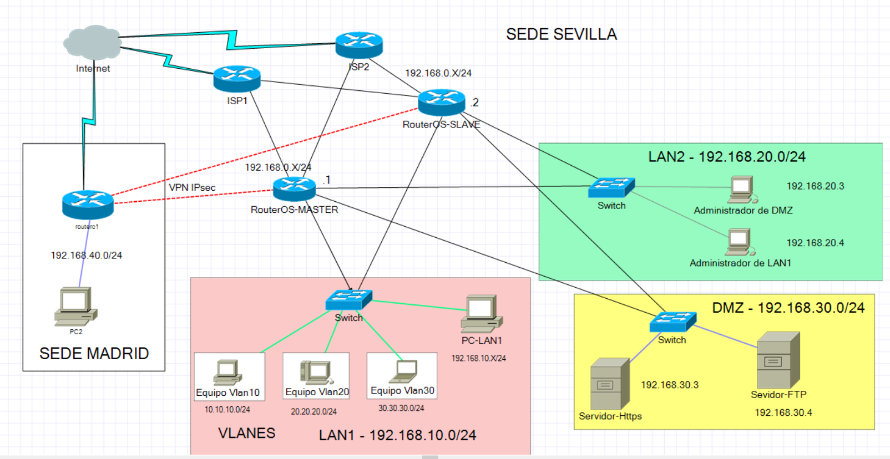

# La planificación se realizara en diferentes fases
## La primera fase sera montar una topografia de red como en la siguiente imagen.

__En la cual se configurara los siguientes aspectos__
- DHCP tanto cliente como servidor
- DNS
- Dar ip a las interfaces y nombrarlas para diferenciarlas.
- Crear redes internas.
- Crear una DMZ y uso de reglas de firewall.
- Creaciones de vlan y bridges.
- Creación de vpn entre dos router de diferentes redes con IPsec.
- Crear reglas básicas de NAT en el firewall, como enmascaramiento.

Todo este apartado estara en el documento de [configuracion de una red empresarial](https://github.com/FranciscoCadena/PI-Mikrotik/blob/master/Configuraci%C3%B3n_b%C3%A1sica_de_la_Red.md).

## La segunda fase tendrá algunos cambios en la topografía de red respecto a la anterior como se ve en la siguiente imagen.

__En esta parte implementaremos algunos tecnologias para que nuestra red tanga mayor disponibilidad__
- Se implementará un Failover de líneas de respaldo para ambos router con los dos ISP, para cuando uno de ellos falle, automáticamente tire por el otro.
- Se implementará un VRRP entre los dos router de la empresa para las redes estáticas de la DMZ y la LAN2 con ello ayudamos a que cuando un router se dañe sigamos teniendo conexión gracias a que tirara por el otro router, es un proceso muy parecido al failover.
- Se implementara un ancho de banda en la red LAN 2 puesto que tienen salida a internet, para ver como se configura y como funciona.
- Se implementara un balanceo de Carga para la DMZ.

Todo este apartado estara en el documento de [configuración de Herramientas que aportan Alta Disponibilidad](https://github.com/FranciscoCadena/PI-Mikrotik/blob/master/Configuraci%C3%B3n_Herramientas_Alta_Disponibilida.md).

## La tercera fase principalmente consistirá en montar un IDS

__En esta fase se implementara lo siguiente__
- Se implementa el Port knocking en ambos routers, para darle una capa de seguridad frente a quienes quieran conectar remotamente al router, usando un código de puertos.
- Se configuraran ambos router para que nos envíen correo cuando se detecte errores o cualquier anomalía que nosotros queramos que se nos sea avisado, también se configurara el correo para que en una determinada hora de cada día nos mande un backup de la configuración de los router.
- Se configurara Mikrotik para que le envié todos los paquetes que atraviesen el router a un equipo con Suricata instalado como IDS.
- Se monta un sistema Kali, para simular que alguien a entrado a nuestro router y realiza un escaneo de red con nmap, para comprobar si Suricata lo detecta.
- Se configura el protocolo de Layer 7 para filtrar varias paginas y no tener acceso a estas.

Todo esto estara en los archivos de [Suricata-Mikrotik](https://github.com/FranciscoCadena/PI-Mikrotik/blob/master/Suricata_Mikrotik.md) y en el de [configuración de Herramientas de Seguridad](https://github.com/FranciscoCadena/PI-Mikrotik/blob/master/Configuraci%C3%B3n_Herramientas_Seguridad.md).

