# Suricata como IDS junto a Mikrotik

La instalación de Suricata se realiza en un Ubuntu 18.04 Desktop, estando actualizado.

## Instalación de Suricata desde repositorio

Suricata ya viene por defecto en los repositorios de Ubuntu pero es posible que sea una versión antigua, por ello para asegurarnos de que se instala la última versión añadiremos el siguiente __PPA(Personal Package Archive) al repositorio__ con el siguiente comando.
~~~
sudo add-apt-repository ppa:oisf/suricata-stable
~~~

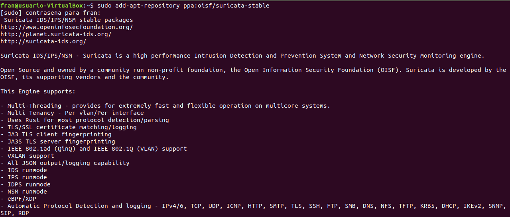

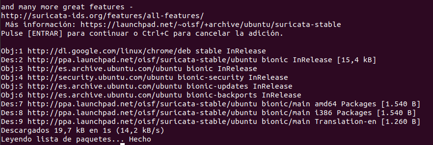

Acto seguido actualizamos nuestro equipo con.
~~~
sudo apt update
~~~

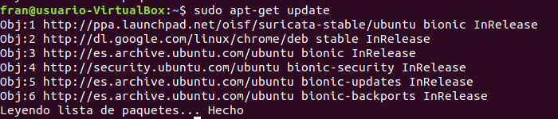

Y pasamos a instalarlo con.
~~~
sudo apt install suricata jq
~~~

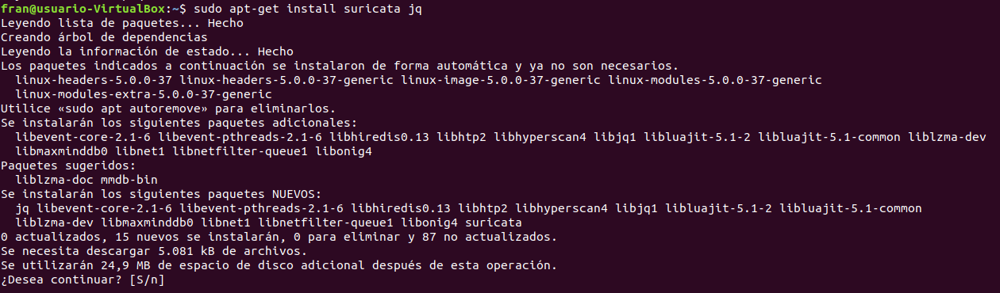

Con el comando anterior instalamos tanto suricata como la herramienta _jq_ la cual nos servirá para trabajar con las salidas que nos aporta el archivo __EVE.json__ del _log_.
 
Una vez instalado suricata podemos confirmarlo usando el siguiente comando para ver en qué estado se encuentra.
~~~
sudo systemctl status suricata
~~~

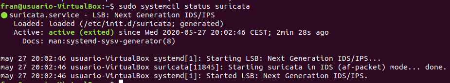

Y tambien podemos usar el siguiente comando que nos dara informacion de todo lo instalado, tanto herramientas, como librerías, directorios de instalación, etc.
~~~
sudo suricata --build-info
~~~ 

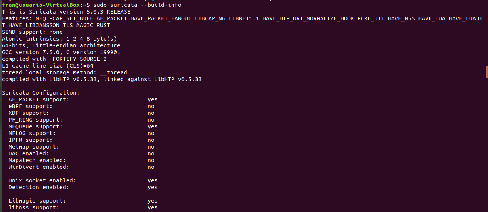

Lo siguiente que haremos será comprobar cuál es nuestra red y nuestra interfaz, para ello podemos usar el comando __ip a__ o cualquier otro que deseemos que nos de la información que deseamos.

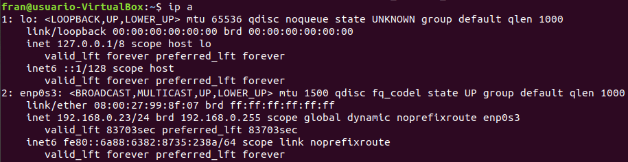

Una vez que conocemos estos datos iremos al archivo de configuración de suricata, que se encuentra en __/etc/suricata/suricata.yaml__, una vez dentro buscamos el _HOME_NET_ y especificamos la red que tenemos, por ejemplo si tenemos la siguiente ip 192.168.0.10, definiremos en el Home_Net que nuestra red se encuentra en 192.168.0.0/24 o podemos directamente definir la ip de nuestra interfaz siempre que esta sea fija.

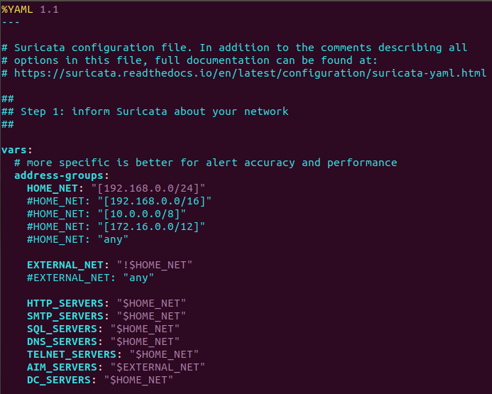

~~~
af-packet:
- interface: enp0s3
   cluster-id: 99
   cluster-type: cluster_flow
   defrag: yes
   use-mmap: yes
   tpacket-v3: yes
~~~

Seguidamente buscaremos en el documento todos los interfaces _eth0_ y los sustituiremos por el nuestro, una vez terminado guardamos, y pasaremos al siguiente fichero de texto __/etc/default/suricata__ donde buscaremos todos los _eth0_ y los sustituiremos por nuestra interfaz, al terminar guardamos y salimos.

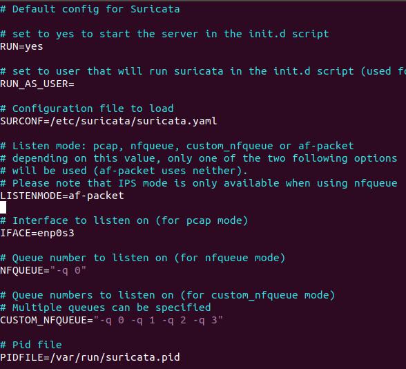

Nuestro siguiente paso será instalar la herramienta __Suricata-update__ la cual es muy importante en suricata debido a que nos proporciona las _reglas_ para las _alertas_ que usará suricata, estas vienen firmadas de diversas fuentes, de esta manera las podemos descargar y tener siempre actualizadas.
Para ello tan solo debemos ejecutar el siguiente comando.
~~~
sudo suricata-update
~~~

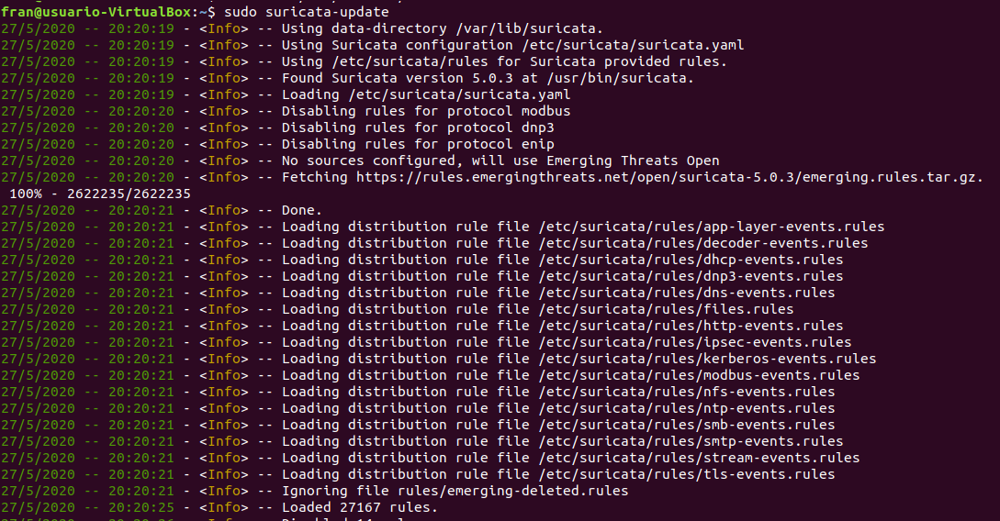

Este comando funciona con versiones de suricata del 4.1 en adelante si son más antiguas habrá que instalarlo con los siguientes comandos:
~~~
apt install python-pip
pip install pyyaml
pip install https://github.com/OISF/suricata-update/archive/master.zip
pip install --pre --upgrade suricata-update
~~~
Todas las reglas se instalarán en la ruta por defecto __/var/lib/suricata/rules__, dentro del archivo __suricata.rules__.
 
Ahora reiniciamos suricata con.
~~~
sudo systemctl restart suricata
~~~ 

Luego nos aseguramos de que suricata está corriendo comprobando su fichero de _log_, usando el comando. 
~~~
sudo tail /var/log/suricata/suricata.log
~~~

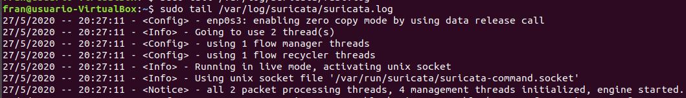

La linea mas importante de todo lo que nos muestra es la siguiente.
<Notice> - all 4 packet processing threads, 4 management threads initialized, engine started.
La cantidad de __threads(hilos)__ dependera del sistema y su configuración.  
 
### OPCIONAL
Una vez que comprobamos que suricata está instalado y corriendo, vamos a actualizar las fuentes, para ello ejecutamos.
~~~
sudo suricata-update update-sources
~~~

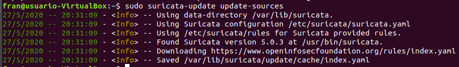

Luego vemos una lista de todas las fuentes disponibles con.
~~~
sudo suricata-update list-sources
~~~

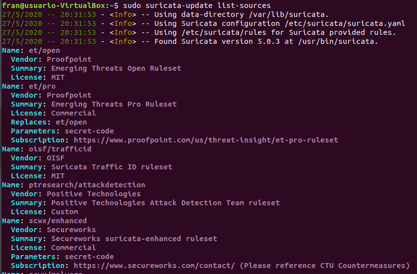

Una vez que veamos el que nos interesa tan solo debemos activarlo, en este ejemplo se activa el _OISF_, usando el __name__ completo que vimos en la lista anterior. 
~~~
sudo suricata-update enable-source oisf/trafficid
~~~

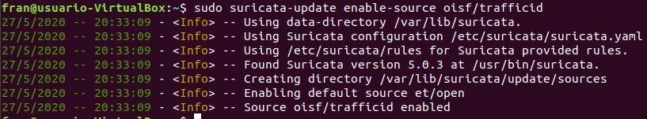

Y luego actualizamos nuestras reglas.
~~~
sudo suricata-update
~~~
Ahora debemos reiniciar suricata con.
~~~
sudo systemctl restart suricata
~~~ 
Comprobamos las listas activas de la fuente con.
~~~
sudo suricata-update list-enabled-sources
~~~ 

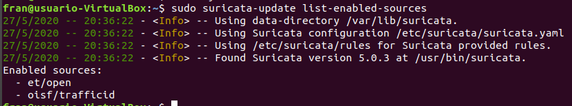

Como se dijo antes todas las reglas van a un archivo llamado _suricata.rules_ que se encuentra en la ruta _/var/lib/suricata_, para comprobar que suricata está leyendo correctamente de esta dirección vamos al archivo de configuración el cual se encuentra en _/etc/suricata/suricata.yaml_ y buscamos __rule-files__ donde deberá estar el archivo _suricata.rules_ y en __default-rule-path__ debera estar la ruta _/var/lib7suricata/rules_.

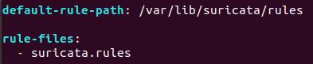 
 
Para poder definir qué reglas queremos tener activas y cuales desactivadas lo normal es modificar el archivo __suricata.rules__,  para poder entrar al directorio donde se encuentra _/var/lib/suricata_, debemos ser root.

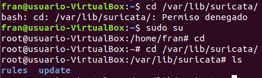 

Otra forma que no viene por defecto al instalar el suricata-update es teniendo varios archivos en la ruta _/etc/suricata_ para definir lo que queremos hacer con cada regla, esos archivos son los siguiente.
- __/etc/suricata/enable.conf__, activar reglas
- __/etc/suricata/disable.conf__, desactivar reglas
- __/etc/suricata/drop.conf__, eliminar reglas
- __/etc/suricata/modify.conf__, modificar reglas
Podemos ejecutar el siguiente comando para tener un ejemplo de cada uno de ellos con. 
~~~
suricata-update --dump-sample-configs
~~~

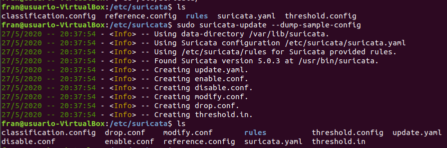 

Aparte de tener estos archivos debemos especificarlos en el archivo de configuración de suricata el __suricata.yaml__, para poder ver un ejemplo mas claro de esto podemos visitar la siguiente pagina [suricata-update](https://suricata-update.readthedocs.io/en/latest/update.html#example-configuration-files).
De todas formas el futuro del uso de suricata es realizando todo desde el archivo _suricata.rules_.
 
## Preparando Suricata

Una vez que ya tenemos instalado Suricata y probado, nuestro siguiente paso será hacer que trabaje junto a Mikrotik, para ello primero haremos unos pasos previos.
En el equipo donde tengamos instalado Suricata nos descargamos la herramienta __Trafr__  la cual es una aplicación escrita por Mikrotik para _convertir el tráfico TZSP a PCAP_. La aplicación es de 32 bits, por lo que para iniciarla se necesitará habilitar el soporte para aplicaciones de 32 bits en Ubuntu a 64 bits.
Por ello lo primero será instalar la siguiente librería con
~~~
sudo apt-get install libc6-i386
~~~

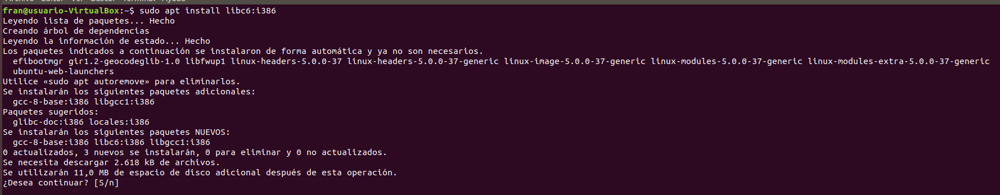

Creamos una carpeta llamada _mikrotik_ y luego descargamos Trafr  del siguiente enlace con wget http://www.mikrotik.com/download/trafr.tgz

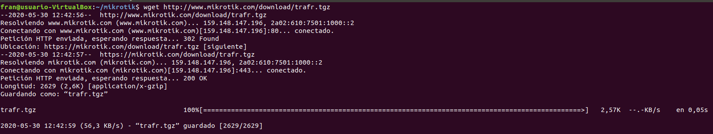

Lo descomprimimos con _tar -zvxf trafr.tgz_.

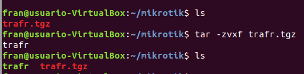

Probamos a ver si captura los paquetes ejecutando __./trafr -s__ si nos van apareciendo líneas encriptadas cada poco tiempo es que está capturando los paquetes y funciona correctamente. 

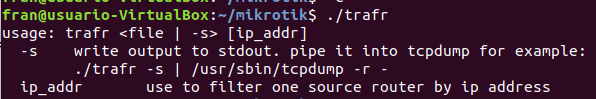

Ahora que sabemos que funciona movemos trafr a la siguiente ruta _/usr/local/bin_
 
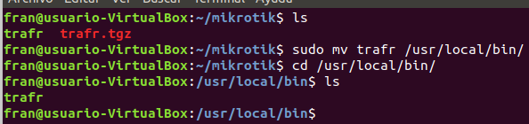

## Preparando Mikrotik

Ahora que tenemos preparado nuestro IDS, configuraremos Mikrotik para que le envíe todo el tráfico que atraviesa el router a nuestro equipo que tiene Suricata instalado.
Para ello lo primero será darle una ip a uno de los puertos donde irá conectado, en este ejemplo conectamos el equipo suricata al _ether5_ así que para diferenciarlo primero le daremos un nombre.

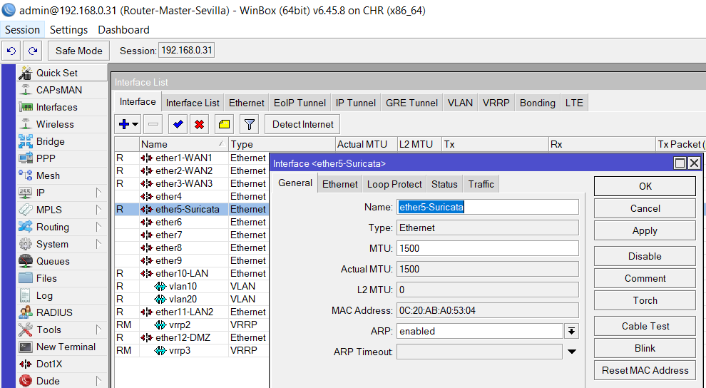

Luego le damos un direccionamiento, no crearemos ningún  servicio de dhcp porque nos interesa que la ip de Suricata sea fija.
Ahora tenemos varias formas de redirigir el tráfico desde el router a nuestro Suricata.

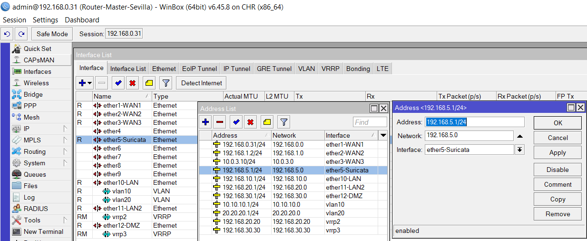

La primera es con la herramienta de _Packet Sniffer_ para ello vamos al menú izquierdo, __Tool → Packet Sniffer__, una vez aquí vamos a la pestaña de _Streaming_, marcamos las casilla de _Filter Stream_ y _Streaming Enabled_ y en el apartado de _Server_ escribimos la ip de nuestro Suricata que será el que le daremos nosotros como ip fija.
Una vez configurado solo debemos darle al botón _Strart_.

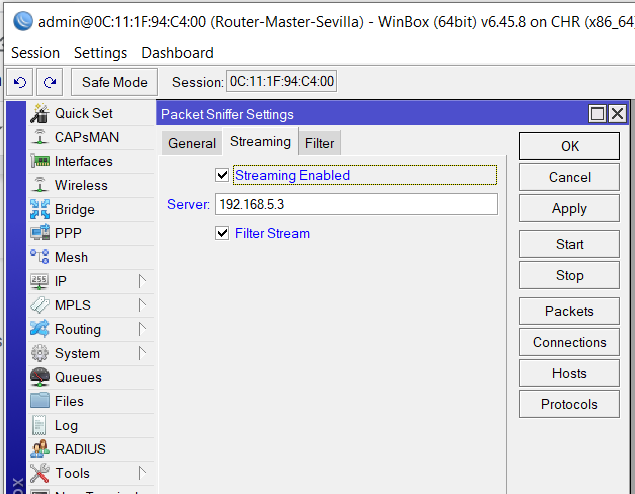

El segundo método es creando una _regla Mangle o de marcado_, con lo que iremos a __Ip → Firewall__ y luego a la pestaña de _Mangle_.
Creamos una nueva regla donde en la pestaña _General_ el apartado de _Chain_ lo dejamos en __forward__.
Luego vamos a la pestaña de _Action_, en el apartado de _Action_ seleccionamos la opción de __sniff TZSP__, en _Sniff Target_ escribimos la ip de nuestro equipo Suricata, y en _Sniff Target Port_ definimos el puerto por el que irá a nuestro equipo Suricata, el cual será el _UDP 37008_ que es reconocido también por Wireshark para el encapsulamiento de paquetes por  _TZSP(TaZmen Sniffer Protocol)_.
Este puerto deberá estar abierto también en nuestro equipo Suricata.

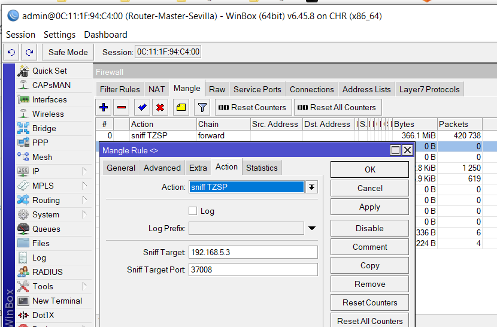

La ventaja de usar la regla Mangle es que podemos definir, qué interfaz, puerto o direccionamiento queremos capturar y enviar a analizar a nuestro equipo Suricata, mientras que la herramienta Packet Sniffer envía todo el tráfico, por consiguiente el equipo donde esté instalado Suricata requerirá de tener bastante memoria RAM y al menos 4 CPU para que trabajen todos los multihilos de Suricata.

El tercer método se realiza con un __Switch__ realizando un _Port Mirror_, por ello aquí no se verá debido a que nuestra virtualización se está realizando sobre RouterOS.

## Pruebas Nmap en la red con Kali linux

En este apartado vamos a mostrar ejemplos de cómo suricata detecta un escaneo de puertos realizado por nmap.
Para ello como se puede observar en el documento de [Planificación de la Red de una empresa](https://github.com/FranciscoCadena/PI-Mikrotik/blob/master/Planificaci%C3%B3n_de_la_Red_de_una_empresa.md), en la fase 3 hay conectado un equipo kali linux al router master.

Esto es para hacer pruebas de vulnerabilidades a la red. Porque en la realidad no se montaría un equipo atacante en tu propia red.

La idea es simular que alguien de fuera a podido conectarse o entrar a nuestro router, y su siguiente paso será hacer un escaneo de red y puertos para ver todos los puertos abiertos y que redes privadas existen.

Con esto pretendemos ver cómo detecta suricata ese escaneo y comprobar la cantidad de alertas que mostraría, esto será interesante porque si por ejemplo tenemos montado suricata para que nos avise de cualquier alerta ya sea por telegram, correo u otro medio es posible que nos sature este por la cantidad de avisos.

Para realizar esto es tan sencillo como tener corriendo suricata para que recoja los paquetes que le envíe mikrotik, con los archivos fast.log y eve.json corriendo.
Y luego con el equipo kali linux ejecutar nmap a la red, usando la opción -sS de esta forma se está realizando un escaneo TCP SYN y se intercambian los paquetes SYN, la conexión no queda establecida porque no se manda el ACK del SYNC que manda el servidor destino sino que se envía un RESET.

Haremos un escaneo primero al router cuya ip es 192.168.0.31.

Una vez visto los puertos que tenemos abiertos en nuestro router podemos dirigirnos desde nuestro router mikrotik a __IP → Services__ o también a __IP → firewall en la pestaña de service port__, en ambos encontraremos información de puertos abiertos para servicios, donde podemos deshabilitar los que no usemos o crear reglas para dropear lo que llegue por ellos, varias de las medidas que podemos usar para securizar nuestro router la podemos sacar desde la página oficial de mikrotik por este [enlace](https://wiki.mikrotik.com/wiki/Firewall) 

Luego realizamos un escaneo a uno de los equipo de la red LAN2, por ejemplo a la ip 192.168.20.3.

Podemos comprobar como con suricata nos da muchas alertas, esto es en parte debido a que este equipo como se puede ver en la captura de kali linux tiene muchos puertos abiertos. 
Y el archivo de eve.json que es el de abajo a la izquierda da tanta información que cuesta entenderlo. 
Si suricata nos tuviera que avisar de todas esas alertas tendremos muchos mensajes.

Para poder trabajar de forma más amigable con el archivo eve.json está la herramienta __jq__ la cual se instaló en la parte que se explicaba como instalar Suricata, esta herramienta ayuda a analizar y filtrar los resultados del archivo .json.

Podemos ver algunos ejemplos en este enlace de [Suricata](https://suricata.readthedocs.io/en/suricata-4.1.4/output/eve/eve-json-examplesjq.html) o este otro de la página de [Stamus-network](https://www.stamus-networks.com/2015/05/18/looking-at-suricata-json-events-on-command-line/).

Como ejemplos con capturas para ver como se vería, tenemos este con el comando:

~~~
tail -f eve.json | jq ‘.’
~~~

y este otro para filtrar por tipo de evento el cual será alertas, con el comando: 

~~~
tail -f eve.json | jq -c 'select(.event_type=="alert")’
~~~

Por último hacemos un escaneo a la red 192.168.0.0/24.

Como vemos en la imagen de suricata nos muestra todas las redes y puertos abiertos en cada una de ellas.

Y con suricata la información que nos da es abrumadora, puesto que se va recogiendo todos los puertos e ip a la cual le está realizando he escaneo kali. 

